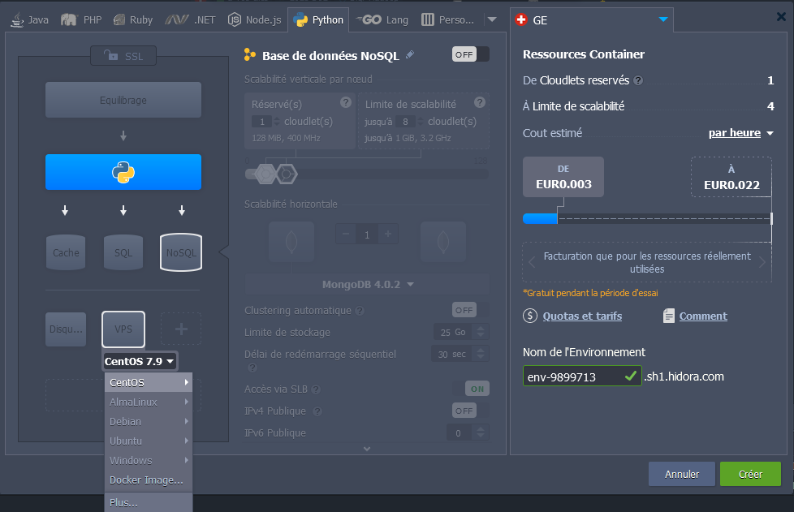

 

 

# Introduction Hadoop & Python

 

## <u>Sommaire</u>

- [I. Présentation de la formation](#i-présentation-de-la-formation)
- [II. Positionnement de Hadoop et Python](#ii-positionnement-de-hadoop-et-python)
- [III. Présentation de Hidora](#iii-présentation-de-hidora)
  - [A. Qu'est ce que Hidora ?](#a-quest-ce-que-hidora-)
  - [B. Comment l'utiliser ?](#b-comment-lutiliser-)
  - [C. Faciliter les transferts de fichier](#c-faciliter-les-transferts-de-fichier)
- [IV. Présentation de Hadoop](#iv-présentation-de-hadoop)

## <u>I. Présentation de la formation</u>

➢ Nous allons ensemble découvrir le Framework Apache Hadoop.  
➢ Nous allons définir les notions de NoSQL, de Big Data.  
➢ Nous allons définir les notions de l’écosystème Hadoop.  
➢ Nous allons voir les notions théoriques et la couche d’abstraction Hadoop FS :

- Comment utiliser l'HDFS que ce soit en ligne de commande, ou via l'API Java (avec le langage Python) ou encore même via l'API HTTP.

➢ Nous allons voir le paradigme MapReduce qui sert à faire des traitements distribués et parallélisés sur les très fortes volumétries de données.  
➢ Nous ferons tourner nos programmes Python via Hadoop Streaming.

## <u>II. Positionnement de Hadoop et Python</u>

Avec L’augmentation des données, les entreprises commencent à centraliser le stockage et le traitement des données sur un serveur central dans une architecture client/serveur.

Ces données sont gérées dans le serveur par un SGBDR (type Oracle, SQL Server, BD 2, etc). Le serveur central, ici, est une machine très puissante, conçue sur mesure par des sociétés.

La croissance des données de l’entreprise était gérée par upsizing du serveur, c’est-à-dire par augmentation de la capacité physique de ses composants.

➢ Problèmes dans le contexte actuel :

- l’échelle de croissance des données aujourd’hui surpasse la capacité raisonnable des technologies traditionnelles, ou même la configuration matérielle typique supportant les accès à ces données. La centralisation du stockage et du traitement des données sur un serveur central crée une pression importante sur l’architecture informatique de l’entreprise,
- L’upsizing qui est utilisé pour rendre le serveur central capable de s’adapter à l’augmentation du volume de données (on parle de scalabilité) est limité à la capacité maximale des composants informatiques. Même si elle ne demande aucune modification sur l’architecture informatique, l’upsizing ne permet pas de dépasser les capacités inhérentes du matériel informatique. L’upsizing augmente la scalabilité du système jusqu’à un certain seuil à partir duquel la performance du système reste la même.

Google fait partie des premières entreprises qui ont très tôt ressenti ces faiblesses.

Dans la vision de Google, avec la baisse des coûts d’ordinateurs, le futur du traitement informatique reposerait sur la constitution de Data Centers composés de plusieurs machines commodes (les clusters).

Par ce point de vue, Google a introduit une nouvelle stratégie technologique qui va progressivement remplacer l’architecture client/serveur classique.

L’approche proposée par Google consiste à distribuer le stockage des données et à paralléliser leur traitement sur plusieurs PC commodes organisées en cluster (on parle de nœuds).

Hadoop est l’implémentation logicielle la plus mature qui permet de mettre en œuvre cette approche.

Hadoop est actuellement la seule plateforme mature qui implémente avec succès la stratégie de distribution du stockage et de parallélisme de données.

➢ Python et le Big Data sont la combinaison parfaite !

- Ce succès revient au fait que Python offre une variété de fonctionnalités et de librairies pour explorer et transformer de grands formats de données.
- Python est un langage facile à apprendre car il résume beaucoup de fonctionnalités qui auraient nécessité plusieurs lignes de code dans un autre langage.
- Python dispose des packages et librairies d’analyse bien testés. En effet, il dispose d’une multiplicité de librairies pour les différents besoins du programmeur, tels que le calcul numérique, l’analyse de données, l’analyse statistique, la visualisation des données ou bien l’apprentissage automatique:Tensorflow, Numpy, Matplotlib…..
- Compatibilité avec hadoop , package pydoop: l’API HDFS de Hadoop, API MapReduce

Docker est une plateforme de conteneurs ayant largement contribué à la démocratisation de la conteneurisation. Elle permet de créer facilement des conteneurs et des applications basées sur les conteneurs.

Les conteneurs sont de plus en plus utilisés pour le déploiement des applications. ce qu’est un conteneur?

1. Un environnement d’exécution léger, et d’une alternative aux méthodes de virtualisation traditionnelles basées sur les machines virtuelles.
2. le conteneur partage le kernel de son OS avec d’autres conteneurs.
3. un conteneur est plus léger et plus simple qu’une machine virtuelle.

➢ **Docker file:** Il s’agit d’un fichier texte rédigé dans une syntaxe compréhensible, comportant les instructions de création d’une image Docker. Un Dockerfile précise le système d’exploitation sur lequel sera basé le conteneur, et les langages, variables environnementales, emplacements de fichiers, ports réseaux et autres composants requis.

➢ **Les images Docker:** un modèle en lecture seule, utiliser pour créer des conteneurs Docker. Elle est composée de plusieurs couches empaquetant toutes les installations, dépendances, bibliothèques, processus et codes d’application nécessaires pour un environnement de conteneur pleinement opérationnel.

➢ **Les conteneurs Docker:** une instance d’image Docker. En lançant un conteneur, on ajoute une couche inscriptible sur l’image. Ceci permet de stocker tous les changements apportés au conteneur durant le runtime.

Après avoir écrit le Dockerfile, on invoque l’utilitaire ” build “pour créer une image basée sur ce fichier. Cette image se présente comme un fichier portable indiquant quels composants logiciels le conteneur exécutera et de quelle façon.

Les conteneurs sont conçus pour être temporaires, mais peuvent être arrêtés et redémarrés dans le même état. Plusieurs instances d’une même image peuvent être exécutées simultanément.

Docker run: l’utilitaire “run” de Docker est la commande permettant de lancer un conteneur. Chaque conteneur est une instance d’une image.

## <u>III. Présentation de Hidora</u>

### **A. Qu'est ce que Hidora ?**

Fondée en 2016, Hidora est un fournisseur de solutions d’hébergement Cloud basé en Suisse.

Ils proposent à leurs clients, des services d’hébergement très fiables basés sur les nouvelles technologies. Ils disposent d'environnement préconfigurées accessible rapidement et facile d'utilisation comme spring, symfony, prestashop...

Il est aussi possible de créer ses propres machines personnalisées sur une base windows, ubuntu, debian, centos... ou encore image Docker. Tout cela est disponible contre une rétribution à l'utilisation en fonction des performances de la machine virtuelle créée.

 

### **B. Comment l'utiliser ?**

Vous allez avoir accès à des VMs préconfigurées avec tous les outils que vous aurez besoin pour les cours ou projets. Pour accéder aux VMs, il va falloir utiliser [le protocole SSH (Secure Shell)](https://fr.wikipedia.org/wiki/Secure_Shell) qui est une méthode permettant d'envoyer en toute sécurité des commandes à un ordinateur sur un réseau non sécurisé, et donc le manipuler et le contrôler à distance en passant par cloud.

On vous a préparé 2 documentations. Une pour utiliser le protocole SSH directement en ligne de commande, et l'autre pour l'utiliser à travers le logiciel [PuTTY](https://www.putty.org/), un émulateur de terminal. Dans les 2 cas, il faudra utiliser l'ip de la VM en plus du port public relié au port privé du protocole que l'on souhaite accéder.

Dans notre cas, comme nous avons besoin de nous connecter au port public du protocole SSH et qu'il est configuré par défaut sur le port privé 22. Alors, dans notre exemple, on devra utiliser le port public 11698 en plus de l'ip 'node176237-env-1839015-etudiant0.sh1.hidora.com'.

> :warning: L'ip et le port change pour chaque machine
>
> Vous aurez les informations de connexion à vos VM en temps et en heure

 

### **C. Faciliter les transferts de fichier**

Comme avec SSH nous n'avons accès qu'à une console et qu'il est intéressant de savoir comment transférer des fichiers entre la VM distante et votre machine en local. Alors, on va utiliser un autre protocole qui se repose sur SSH et qui se nomme le [SCP (Secure copy)](https://fr.wikipedia.org/wiki/Secure_copy).

Comme SSH, vous aurez à disposition 2 documentations à disposition. Une pour utiliser nativement SCP dans le terminal, et une autre à travers l'utilisation du logiciel FileZilla. Les 2 méthodes utiliseront la même ip et le même port que pour le SSH / PuTTY.

## <u>IV. Présentation de Hadoop</u>

 

### **Introduction de son écosystème**

 

- [A. Comprendre le NoSQL](#a-comprendre-le-nosql)
- [B. Définition du Big Data](#b-définition-du-big-data)
- [C. Architecture de Hadoop](#c-architecture-de-hadoop)
- [D. L'Écosystème de Hadoop](#d-lécosystème-de-hadoop)
  - [1. Couche de stockage (Hadoop Distributed File System)](#1-couche-de-stockage-hadoop-distributed-file-system)
  - [2. Couche de traitement / calcul (MapReduce)](#2-couche-de-traitement--calcul-mapreduce)
  - [Hadoop](#hadoop)
- [E. Rôle des différents composants de l'écosystème Hadoop](#e-rôle-des-différents-composants-de-lécosystème-hadoop)
- [F. Distributions d’Hadoop](#f-distributions-dhadoop)

➢ Avec immenses volumes de données, les bases de données relationnelles étaient devenues trop lentes. Plutôt que de mettre à jour leur équipement informatique pour accroître les performances des RDBMS (Relational Database Management System), les géants de la technologie ont choisi de distribuer la charge sur de multiples serveurs hôtes. C’est la méthode dite du «scaling out ».

➢ Les bases de données NoSQL sont idéales pour le scaling-out, puisqulles dont non relationnelles.

➢ La principale particularité des bases de données NoSQL est:

- Elles ne suivent pas le modèle relationnel et ne présentent pas de tableaux sous forme de colonnes fixes.
- Elles ne nécessitent pas de normalisation de données ou de mapping relationnel.
- Elles tolèrent l’absence ou la flexibilité des schémas. Il n’est pas nécessaire de définir de schéma des données, et les données de différentes structures peuvent donc être regroupées sur un même système.

### **A. Comprendre le NoSQL**

- Dans l'analyse Big Data, Hadoop joue un rôle essentiel dans la résolution des problèmes commerciaux typiques en gérant de grands ensembles de données et offre les meilleures solutions dans le domaine de l'analyse.
- Dans l'écosystème Hadoop, chaque composant joue son rôle unique pour :
- Le traitement de l'information
- La validation des données
- Le stockage de données

➢ En termes de stockage de données semi-structuré non structuré ainsi que de récupération de ces données, les bases de données relationnelles sont moins utiles.

➢ En outre, la récupération des résultats en appliquant une requête sur d'énormes ensembles de données stockés dans le stockage Hadoop est une tâche difficile.

➢ Les technologies de stockage NoSQL offrent la meilleure solution pour des requêtes plus rapides sur des ensembles de données énormes et offrent aussi une montée en charge, ou scalabilité horizontale.

➢ Une base de données NoSQL (parfois appelée Not Only SQL) est une base de données qui fournit un mécanisme pour stocker et récupérer des données autres que les relations tabulaires utilisées dans les bases de données relationnelles. Ces bases de données sont sans schéma, prennent en charge la réplication facile, ont une API simple, éventuellement cohérente, et peuvent gérer d'énormes quantités de données.

➢ L'objectif principal d'une base de données NoSQL est d'avoir

- Une simplicité de conception,
- Une mise à l'échelle horizontale, et
- une haute disponibilité.

➢ Les bases de données NoSql utilisent des structures de données différentes des bases de données relationnelles.

➢ Les choix d’une base NoSQL dépend du problème à résoudre

**<u>NoSQL vs Base de Données Relationnelle</u>**

Le tableau suivant répertorie les points qui différencient une base de données relationnelle d'une base de données NoSQL.

| **BD Relationnelle**                                 | **BD NoSQL**                     |
| ---------------------------------------------------- | -------------------------------- |
| langage de requête simple                            | langage de requête très puissant |
| schéma fixe                                          | Aucun schéma fixe                |
| ACID (atomicité, cohérence, isolement et durabilité) | BASE (éventuellement cohérent)   |
| Transactions                                         | pas de transactions              |

➢ On distingue quatre principaux types de bases de données NoSQL : paire clé / valeur, orientée colonne, orientée graph, et orientée document.

➢ Toutefois aucun de ces quatre types de bases de données ne permet de résoudre n’importe quel problème. Il est nécessaire de choisir la base de données adéquate en fonction du cas d’usage.

➢ **paire clé / valeur**, les données sont stockées sous forme de paires clé / valeur. Ceci permet la prise en charge de larges volumes de données et de charges lourdes. Les données sont entreposées dans un tableau de » hash » au sein duquel chaque clé est unique. La valeur peut être un JSON, un objet BLOB, une ligne de code ou autre.Ce type de base de données est le plus basique. Il permet au développeur de stocker plus facilement des données sans schéma.

Par exemples, on peut citer Redis ou Dynamo. D’ailleurs, Amazon Dynamo est le modèle initial de cette catégorie de database.

➢ **Les bases de données orientées colonnes**, comme leur nom l’indique, repose sur des colonnes. Elles sont basées sur le modèle BigTable de Google. Chaque colonne est traitée séparément, et les valeurs sont stockées de façon contigüe. Cette catégorie de base de données offre de hautes performances pour les requêtes d’agrégation comme SUM, COUNT, AVG et MIN. Pour cause, les données sont déjà disponibles et prêtes dans une colonne.

Par exemples, on peut citer HBase, Cassandra ou Hypertable.

➢ **Les bases de données Graph-Based** stockent les entités et les relations entre ces entités. L’entité est stockée sous forme de noeud, et les relations comme bordures. Il est ainsi facile de visualiser les relations entre les noeuds. Chaque noeud et chaque bord ont un identifiant unique. Ce type de base de données est multirelationnel. On l’utilise principalement pour les réseaux sociaux, la logistique ou les données spatiales.

Par les exemples les plus populaires, on peut citer Neo4J, Infinite Graph, OrientDB et FlockDB.

➢ **Les bases de données orientées document** stockent et retrouvent elles aussi les données sous forme de paire clé-valeur. Toutefois, la valeur est stockée sous forme de document au format JSON ou XML. La valeur est ainsi comprise par la base de données et peut être trouvée à l’aide d’une requête. Ce type de base de données offre donc une flexibilité accrue. il ne convient pas pour les transactions complexes nécessitant des opérations ou des requêtes multiples sur des structures agrégées variables.

Par exemple les plus connus dans cette catégorie sont Amazon SimpleDB, CouchDB, MongoDB, Riak, Lotus Notes et MongoDB.

➢ **Apache HBase** - HBase est une base de données distribuée open source, non relationnelle, modelée d'après BigTable de Google et écrite en Java. Elle est développée dans le cadre du projet Apache Hadoop et fonctionne au-dessus de HDFS, fournissant des capacités de type BigTable pour Hadoop.

➢ **MongoDB** - MongoDB est un système de base de données orienté document multiplateforme qui évite d'utiliser la structure de base de données relationnelle traditionnelle basée sur une table au profit de documents de type JSON avec des schémas dynamiques rendant l'intégration des données dans certains types d'applications plus facile et plus rapide

➢ Certains des modèles NoSQL présents sur le marché sont Cassandra, MongoDB et CouchDB. Chacun de ces modèles possède différents mécanismes de stockage voir les principaux moteurs de stockage NoSQL dans la figure ci-dessous.

➢ Caractéristiques CAP (Consistency, Availability, Partition tolerance)

- Consistency ou cohérence des données : toute modification de donnée est suivie d’effet pour tous les nœuds du système.
- Availability ou disponibilité des données : toute requête émise et traitée par un nœud du système, reçoit une réponse (même en situation d’échec à produire une réponse).
- Partition tolérance ou recouvrement des nœuds assurer une continuité du fonctionnement en cas d’ajout/suppression de nœud (ou partition) du système distribué.

  ❖ Remarque: Constat de Brewer : aucun des systèmes distribués n’est à même de satisfaire en même temps les principes C, A et P

➢ Un système distribué va satisfaire deux des trois points CAP Considérations SGBDR / Systèmes NoSQL

➢ SGBDR : Cohérence et haute disponibilité (CA), (pas ou peu de P : de différents nœuds système) Systèmes

➢ NoSQL : Choix du P (système naturellement distribué) et sélection soit du C, soit du A

- Abandon du A ⇐ Accepte d’attendre que les données soient cohérentes.
- Abandon du C ⇐ Accepte de recevoir des données parfois incohérentes.
- Catégorisation des systèmes NoSQL selon les caractéristiques CAP

  

### **B. Définition du Big Data**

➢ À l’heure actuelle, vous avez vu que le Big Data est un terme général qui est utilisé pour désigner toute collection de données si vaste et complexe qu’elle dépasse la capacité de traitement des systèmes et techniques conventionnels de gestion des données. Les applications du Big Data sont infinies.

➢ Chaque partie de l’entreprise et de la société change sous nos yeux en raison du fait que nous avons maintenant beaucoup plus de données et la capacité d’analyser. Mais comment caractériser le Big Data ?

➢ Pour vraiment comprendre le Big Data, il est utile d'avoir un historique. Voici la définition de Gartner, vers 2001 (qui est toujours la définition de référence): ”Bigdata is data that contains greater variety arriving in increasing volumes and with ever-higher velocity. This is known as the three Vs.“

➢ Le Big Data représente des données qui contiennent une grande variété arrivant dans des volumes croissants et avec une vitesse (vélocité) toujours plus élevée. C'est ce qu'on appelle les trois Vs, auxquels vient se greffer les deux V de la Valeur et la Véracité:

- **Volume.** C’est la caractéristique qui vient la plus vite à l’esprit dans ce contexte. Comme nous l’avons évoqué, les sources d’information sont de plus en nombreuses et individuellement, elles vont générer de plus en plus de volume.

- **Variété.** La variété fait référence à la nature des données à traiter. Les sources étant plus nombreuses, la variété des informations est aussi plus importante. Elle est plus importante dans le nombre mais aussi dans ses caractéristiques, dans sa structure. Le spectre est très large depuis les données structurées des systèmes transactionnels, aux données non structurées comme les images ou les vidéos. La Big Data doit donc être en mesure de traiter cette grande variété de données.

- **Vélocité.** C’est le rythme de création des données. Le Big Data, c’est la capacité à intégrer et surtout traiter en temps réel un flux d’informations toujours plus important. Par exemple, dans le cas de la donnée générées par l’ IoT, on parle de plusieurs milliards de capteurs déversant en temps réel des données aussi variées qu’un rythme cardiaque ou la météo dans une ville.

- **Véracité.** « Garbage in, Garbage out », c’est expression relativement ancienne (plus de 25 ans), résume à elle seule l’enjeu. Si la qualité des informations n’est pas bonne dans les systèmes d’information, les résultats et l’usage que l’on pourra en faire seront mauvais.

- **Valeur.** Que vaut un volume massif d’informations si l’on n’est pas capable de l’utiliser ? C’est ce que représente ce 5éme V. C’est la capacité à mettre en œuvre les techniques et outils permettant d’interpréter la Big Data afin d’en retirer de la valeur.

- _En termes simples, le Big Data représente des ensembles de données plus grands et plus complexes, en particulier à partir de nouvelles sources de données. Ces ensembles de données sont si volumineux que les logiciels de traitement de données traditionnels ne peuvent tout simplement pas les gérer. Mais ces volumes massifs de données peuvent être utilisés pour résoudre des problèmes commerciaux que vous n'auriez pas pu résoudre auparavant._

### **C. Architecture de Hadoop**

- Hadoop est un Framework open source Apache écrit en java qui permet le traitement distribué de grands ensembles de données sur des clusters d'ordinateurs à l'aide de modèles de programmation simples. L'application de structure Hadoop fonctionne dans un environnement qui fournit un stockage distribué et des calculs sur des clusters d'ordinateurs. Hadoop est conçu pour passer d'un serveur unique à des milliers de machines, chacune offrant un calcul et un stockage locaux.

  

À sa base, Hadoop a deux couches principales à savoir:

#### <u>1. Couche de stockage (Hadoop Distributed File System)</u>

- Le système de fichiers distribués Hadoop (HDFS) est basé sur le système de fichiers Google (GFS) et fournit un système de fichiers distribué conçu pour fonctionner sur du matériel standard.

- Il présente de nombreuses similitudes avec les systèmes de fichiers distribués existants. Cependant, les différences par rapport aux autres systèmes de fichiers distribués sont importantes. Il est hautement tolérant aux pannes et est conçu pour être déployé sur du matériel à faible coût. Il fournit un accès à haut débit aux données d'application et convient aux applications ayant de grands ensembles de données.

 

#### <u>2. Couche de traitement / calcul (MapReduce)</u>

➢ MapReduce est un modèle de programmation parallèle pour l'écriture d'applications distribuées conçu par Google pour le traitement efficace de grandes quantités de données (ensembles de données multi-téraoctets), sur de grands clusters (milliers de nœuds) de matériel de base d'une manière fiable et tolérante aux pannes. Le programme MapReduce fonctionne sur Hadoop qui est un Framework open-source Apache.

➢ Il est assez coûteux de construire des serveurs plus grands avec des configurations lourdes qui gèrent un traitement à grande échelle, mais comme alternative, vous pouvez relier de nombreux ordinateurs de base avec un seul processeur, en tant que système distribué fonctionnel unique et pratiquement, les machines en cluster peuvent lire l'ensemble de données en parallèle et offrent un débit beaucoup plus élevé.

➢ De plus, il est moins cher qu'un serveur haut de gamme. C'est donc le premier facteur de motivation derrière l'utilisation de Hadoop qui s'exécute sur des machines en cluster et à faible coût.

 

#### <u>Hadoop</u>

Dans Hadoop 1.0, le NameNode est un point de défaillance unique (Single Point of Failure, en abrégé SPOF). Si le NameNode rencontre un problème, les clients ne pourront plus lire/écrire des fichiers. Le système Hadoop entier serait alors hors service jusqu'à ce qu'un NameNode soit en place.

Hadoop 2.0 vient résoudre ce problème en prenant en charge plusieurs NameNodes. La fonctionnalité de haute disponibilité introduit un NameNode supplémentaire dans l'architecture Hadoop. Cette fonctionnalité permet de basculer automatiquement à un autre NameNode (Standby-NameNode ou NameNode de secours) si le principal NameNode (NameNode actif) tombe en panne, de sorte que le cluster continue de fonctionner.

➢ Hadoop exécute du code sur un cluster d'ordinateurs. Ce processus comprend les tâches principales suivantes qu'Hadoop effectue :

1. L0es données sont initialement divisées en répertoires et fichiers. Les fichiers sont divisés en blocs de taille uniforme de 128M et 64M (de préférence 128M).
2. Ces fichiers sont ensuite distribués sur différents nœuds de cluster pour un traitement ultérieur.
3. HDFS, étant au sommet du système de fichiers local, supervise le traitement.
4. Les blocs sont répliqués pour gérer les pannes matérielles.
5. Vérifier que le code a été exécuté avec succès.
6. Effectuer le tri qui a lieu entre les étapes map et reduce.
7. Envoi des données triées à un certain ordinateur.
8. Écriture des journaux de débogage pour chaque travail

➢ Avantages de Hadoop

- Le Framework Hadoop permet à l'utilisateur d'écrire et de tester rapidement des systèmes distribués. Il est efficace et distribue automatiquement les données et le travail sur les machines et utilise le parallélisme sous-jacent des cœurs de processeur.
- Hadoop ne dépend pas du matériel pour fournir une tolérance aux pannes et une haute disponibilité (FTHA), mais la bibliothèque Hadoop elle-même a été conçue pour détecter et gérer les défaillances au niveau de la couche d'application.
- Les serveurs peuvent être ajoutés ou supprimés du cluster de manière dynamique et Hadoop continue de fonctionner sans interruption.
- Un autre gros avantage de Hadoop est qu'en plus d'être open source, il est compatible sur toutes les plateformes car il est basé sur Java et on peut l’utiliser avec différents langages comme le python.

➢ Fichiers de configuration de Hadoop:

- hadoop-env.sh
- core-site.xml
- hdfs-site.xml
- mapred-site.xml
- yarn-site.xml
- Master
- Slave

`ls -l  $HADOOP_HOME/etc/hadoop`

➢ hadoop-env.sh

- Ce fichier spécifie les variables d'environnement qui affectent le JDK utilisé par Hadoop Daemon (bin/hadoop).
- Le framework Hadoop est écrit en Java et utilise l'environnement d'exécution Java, l'une des variables d'environnement importantes pour le démon Hadoop est $JAVA_HOME dans hadoop-env.sh.

  

➢ core-site.xml

- Ce fichier informe le démon Hadoop de l'endroit où NameNode s'exécute dans le cluster. Il contient les paramètres de configuration pour Hadoop Core, tels que les paramètres d'E/S communs à HDFS et MapReduce...

  

➢ hdfs-site.xml

- Ce fichier informe le démon Hadoop de l'endroit où NameNode et datanode répértoire.
- Il contient les paramètres de réplication.

  

➢ mapred-site.xml

- Le fichier mapred-site. xml est utilisé pour la configuration de MapReduce.
- Afin de spécifier quel framework doit être utilisé pour MapReduce, nous utilisons la propriété mapreduce.framework.name, le yarn est utilisé ici.

  

➢ yarn-site.xml

- Le fichier yarn-site. xml est utilisé pour la configuration de Yarn.
- Shuffling, schedulling policy…….

  

➢ Master

Ce fichier informe sur l'emplacement du nœud de nom secondaire pour le démon hadoop.  
Le fichier « maîtres » sur le serveur maître contient un nom d'hôte de serveurs de nœud de nom secondaire.

➢ slave

The ‘slaves’ file at Master node contains a list of hosts, one per line, that are to host Data Node.  
The ‘slaves’ file on Slave server contains the IP address of the slave node.

### **D. L'Écosystème de Hadoop**

➢ La solution Hadoop a été développée par Doug Cutting suite à des besoins en termes de stockage et traitement de grosses volumétries de données.

➢ L'écosystème Hadoop est l'ensemble des logiciels qui viennent s'y connecter comme Apache Pig, Apache Hive, Apache HBase, Apache Phoenix, Apache Spark, Apache ZooKeeper, Apache Impala, Apache Flume, Apache Sqoop, Apache Oozie, Apache Storm …

### **E. Rôle des différents composants de l'écosystème Hadoop**

➢ **HDFS.** À partir de la base de l'écosystème Hadoop, il existe HDFS ou Hadoop Distributed File System. Il s'agit d'un système qui vous permet de répartir le stockage des données sur un cluster d'ordinateurs.  
Cela signifie que tous vos disques durs ressemblent à un seul cluster géant sur votre système. Ce n'est pas tout; il conserve également les copies redondantes des données. Donc, si l'un de vos ordinateurs tombe en panne ou si des problèmes techniques se produisent, HDFS peut en fait récupérer en créant une sauvegarde à partir d'une copie des données qu'il avait enregistrées automatiquement, et vous ne saurez même pas que c’ est arrivé.  
Donc, c'est la puissance de HDFS, c'est-à-dire que le stockage de données se fait de manière distribuée avec des copies redondantes.

➢ **YARN.**(Yet Another Resource Negotiator). C'est l'endroit où le traitement des données de Hadoop entre en jeu. YARN est un système qui gère les ressources de votre cluster informatique. C'est celui qui décide qui doit exécuter les tâches, quand et quels nœuds sont disponibles pour un travail supplémentaire, et quels nœuds ne sont pas disponibles pour le faire. Donc, c'est comme le rythme cardiaque de Hadoop qui maintient votre cluster en marche.

➢ **MapReduce.** Est une application intéressante qui peut être construite au-dessus de YARN. MapReduce est un modèle de programmation qui vous permet de traiter vos données sur un cluster entier. Il se compose essentiellement de mappeurs et de réducteurs qui sont différents scripts, que vous pourriez écrire, ou différentes fonctions que vous pourriez utiliser lors de l'écriture d'un programme MapReduce.

➢ Les mappeurs ont la capacité de transformer vos données en parallèle à travers votre cluster informatique d'une manière très efficace; tandis que les réducteurs sont responsables de l'agrégation de vos données.

➢ Cela peut ressembler à un modèle simple, mais MapReduce est très polyvalent. Les mappeurs et les réducteurs réunis peuvent être utilisés pour résoudre des problèmes complexes. Nous parlerons de MapReduce dans l'une des prochaines sections de ce cours.

➢ **Apache Pig.** Ensuite, dans l'écosystème Hadoop, nous avons une technologie appelée Apache Pig.  
Il s'agit simplement d'un langage de script de haut niveau qui se trouve au-dessus de MapReduce. Si vous ne voulez pas écrire de codes Java ou Python MapReduce et que vous connaissez mieux un langage de script ayant une syntaxe quelque peu de style SQL, Pig est fait pour vous.  
Il s'agit d'une API de programmation de très haut niveau qui vous permet d'écrire des scripts simples. Vous pouvez obtenir des réponses complexes sans écrire de code Java dans le processus.  
Pig Latin transformera ce script en quelque chose qui s'exécutera sur MapReduce.  
Donc, en termes plus simples, au lieu d'écrire votre code en Java pour MapReduce, vous pouvez continuer et écrire votre code en Pig Latin qui est similaire à SQL. Ce faisant, vous n'aurez pas à effectuer de tâches MapReduce. Au contraire, la simple écriture d'un code Pig Latin exécutera les fonctions MapReduce.  
Donc, en termes plus simples, au lieu d'écrire votre code en Java pour MapReduce, vous pouvez continuer et écrire votre code en Pig Latin qui est similaire à SQL. Ce faisant, vous n'aurez pas à effectuer de tâches MapReduce. Au contraire, la simple écriture d'un code Pig Latin exécutera les fonctions MapReduce.

➢ **Hive.** Il se trouve également au-dessus de MapReduce et résout un type de problème similaire à Pig, mais il ressemble plus à un SQL. Ainsi, Hive est un moyen de prendre des requêtes SQL et de faire en sorte que les données distribuées se trouvant quelque part sur votre système de fichiers ressemblent à une base de données SQL. Il a un langage appelé Hive SQL.  
Il s'agit d'une base de données dans laquelle vous pouvez vous connecter à un client shell et à ODBC (Open Database Connectivity) et exécuter des requêtes SQL sur les données stockées sur votre cluster Hadoop même si ce n'est pas vraiment une base de données relationnelle sous le capot.  
Si vous connaissez SQL, Hive peut être une API ou une interface très utile à utiliser.

➢ **Apache Ambari.** se trouve au-dessus de tout et vous donne une vue de votre cluster. Il s'agit essentiellement d'un outil d'administration open source chargé de suivre les applications et de conserver leur statut. Il vous permet de visualiser ce qui fonctionne sur votre cluster, les systèmes que vous utilisez et la quantité de ressources utilisées. Ainsi, Ambari vous permet d'avoir une vue sur l'état réel de votre cluster en termes d'applications qui s'exécutent dessus. Il peut être considéré comme un outil de gestion qui gérera les moniteurs ainsi que l'intégrité de plusieurs clusters Hadoop.

➢ **Mesos.** ne fait pas vraiment partie de Hadoop, mais il est inclus dans l'écosystème Hadoop car c'est une alternative à YARN. C'est aussi un négociateur de ressources tout comme YARN. Mesos et YARN résolvent le même problème de différentes manières. La principale différence entre Mesos et YARN réside dans leur planificateur.

Dans Mesos, lorsqu'un travail arrive, une demande de travail est envoyée au maître Mesos, et ce que fait Mesos, c'est qu'il détermine les ressources disponibles et fait des offres. Ces offres peuvent être acceptées ou rejetées. Mesos est donc une autre façon de gérer vos ressources dans le cluster.

➢ **Apache Spark.** Est la technologie la plus intéressante de cet écosystème Hadoop. Il se trouve au même niveau que MapReduce et juste au-dessus de Mesos pour exécuter des requêtes sur vos données.  
Il s'agit principalement d'un moteur de traitement de données en temps réel développé afin de fournir des analyses plus rapides et faciles à utiliser que MapReduce. Spark est extrêmement rapide et fait l'objet de nombreux développements actifs.

Il s'agit d'une technologie très puissante car elle utilise le traitement en mémoire des données. Si vous souhaitez traiter vos données de manière efficace et fiable sur le cluster Hadoop, vous pouvez utiliser Spark pour cela. Il peut gérer des requêtes SQL, faire du Machine Learning sur un cluster entier d'informations, gérer des données en streaming, etc.

➢ **Tez.** Est similaire à Spark, il utilise certaines des mêmes techniques que Spark. Il vous indique ce que MapReduce fait car il produit un plan plus optimal pour exécuter vos requêtes. Tez, lorsqu'il est utilisé conjointement avec Hive, a tendance à accélérer les performances de Hive.

Hive est placé au-dessus de MapReduce, mais vous pouvez le placer au-dessus de Tez, car Hive via Tez peut être beaucoup plus rapide que Hive via MapReduce. Ce sont deux moyens différents d'optimiser les requêtes ensemble.

➢ **Apache HBase.** Il est défini sur le côté et c'est un moyen d'exposer les données de votre cluster à la plate-forme transactionnelle. Ainsi, il est appelé la base de données NoSQL, c'est-à-dire qu'il s'agit d'un magasin de données en colonnes qui est une base de données très rapide et est destiné à des taux de transaction élevés.

Il peut exposer des données stockées dans votre cluster qui pourraient être transformées d'une manière ou d'une autre par Spark ou MapReduce. Il fournit un moyen très rapide d'exposer ces résultats à d'autres systèmes.

➢ **Apache Storm.** Outil de traitement des données en streaming. Donc, si vous avez des données en streaming à partir de capteurs ou de blogs, vous pouvez réellement les traiter en temps réel à l'aide de Storm.

Le traitement des données ne doit plus être un traitement par lots; vous pouvez mettre à jour vos modèles Machine Learning ou transformer des données dans la base de données, le tout en temps réel, au fur et à mesure que les données arrivent.

➢ **Oozie.** Outil de planification des travaux sur votre cluster. Donc, si vous avez une tâche à effectuer sur votre cluster Hadoop impliquant différentes étapes et peut-être différents systèmes, Oozie est le moyen de planifier toutes ces choses ensemble dans des travaux pouvant être exécutés dans un certain ordre.

Ainsi, lorsque vous avez des opérations plus compliquées qui nécessitent de charger des données dans Hive, de les intégrer à Pig, et peut-être de les interroger avec Spark, puis de transformer les résultats en HBase, Oozie peut gérer tout cela pour vous et vous assurer qu'il s'exécute de manière fiable sur une base cohérente.

➢ **ZooKeeper.** Une technologie pour tout coordonner sur votre cluster. C'est donc une technologie qui peut être utilisée pour garder une trace des nœuds qui sont en hausse et de ceux qui sont en panne.

C'est un moyen très fiable de garder une trace des états partagés dans votre cluster que différentes applications peuvent utiliser. Beaucoup de ces applications s'appuient sur ZooKeeper pour maintenir des performances fiables et cohérentes sur un cluster, même lorsqu'un nœud tombe au hasard.

Par conséquent, ZooKeeper peut être utilisé pour garder une trace du nœud maître, du nœud en marche ou du nœud en panne. En fait, c'est encore plus extensible que ça.

> **Rôle des collecteurs de données**

➢ Le traitement analytique utilisant Hadoop nécessite le chargement d'énormes quantités de données provenant de diverses sources dans des clusters Hadoop. Ce processus de chargement de données en masse dans Hadoop, à partir de sources hétérogènes puis de traitement, s'accompagne d'un certain ensemble de défis. Maintenir et assurer la cohérence des données et assurer une utilisation efficace des ressources sont quelques facteurs à considérer avant de sélectionner la bonne approche pour le chargement des données.

> **Problèmes majeurs**

1. Chargement des données à l'aide de scripts

- L'approche traditionnelle consistant à utiliser des scripts pour charger des données n'est pas adaptée au chargement de données en masse dans Hadoop; cette approche est inefficace et prend beaucoup de temps.

2. Accès direct aux données externes via l'application Map-Reduce

- La fourniture d'un accès direct aux données résidant sur des systèmes externes (sans chargement dans Hadoop) pour les applications MapReduce rend ces applications plus compliquées. Donc, cette approche n'est pas faisable.

3. Traitement de données hétérogènes

- En plus d'avoir la capacité de travailler avec d'énormes données, Hadoop peut travailler avec des données sous plusieurs formes différentes. Ainsi, pour charger de telles données hétérogènes dans Hadoop, différents outils ont été développés. Sqoop et Flume sont deux de ces outils de chargement de données.

> **Sqoop Vs FlumE Vs HDFS :**

> **Ingestion de données :**

➢ Les systèmes énumérés ci-dessous dans l'écosystème Hadoop se concentrent principalement sur le problème de l'ingestion de données, c'est-à-dire la façon d'obtenir des données dans votre cluster et dans HDFS à partir de sources externes. Jetons-y un œil

- **Sqoop.** Est un outil utilisé pour transférer des données entre les serveurs de bases de données relationnelles et Hadoop. Sqoop est utilisé pour importer des données de diverses bases de données relationnelles comme Oracle vers Hadoop HDFS, MySQL, etc, et pour exporter de HDFS vers des bases de données relationnelles.

- **Flume.** Est un service d'agrégation, de collecte et de déplacement de grandes quantités de données de journal. Flume a une architecture flexible et simple basée sur des flux de données en streaming. Son architecture est robuste et tolérante aux pannes avec des mécanismes fiables et de récupération. Il utilise le modèle de données extensible qui permet des applications analytiques en ligne. Flume est utilisé pour déplacer les données de journal générées par les serveurs d'applications vers HDFS à une vitesse plus élevée.

- **Kafka.** Kafka est également un logiciel de traitement de données en streaming open source qui résout un problème similaire à Flume. Il est utilisé pour créer des pipelines de données en temps réel et des applications de streaming, ce qui réduit la complexité. Il est évolutif horizontalement et tolère les pannes. Kafka vise à fournir une plate-forme unifiée à faible latence pour gérer les flux de données en temps réel. La communication et les messages asynchrones peuvent être établis avec l'aide de Kafka. Cela garantit une communication fiable.

### **F. Distributions d’Hadoop**

➢ Hadoop comporte plusieurs briques logicielles, plusieurs contributeurs et plusieurs mainteneurs, ce qui entraîne plusieurs cycles de version pour les outils. En conséquence une maîtrise des versions compatibles entre elles est très complexe, cela nécessite également une configuration entre les composants, également très complexe et présente de grandes difficultés à l'installation.
➢ De ce fait, on va avoir plusieurs distributions qui se positionnent, afin de faciliter le déploiement d'Hadoop. Une distribution est un ensemble de briques d'Hadoop pré packagées, mises ensemble, et configurées pour fonctionner ensemble. L'intérêt d'un package complet c'est qu'il permet de démarrer plus facilement, plus rapidement et d'avoir un support.
➢ Les exemples de solution pour la distribution Hadoop les plus connues sont MapR, Cloudera, Hortonworks.

> **Distribution MapR**

➢ MapR a été créé en 2009 par une équipe de Google, MapR mentionne trois versions, une version open source et deux versions payantes. MapR à la spécificité d'avoir développé plusieurs composants du noyau d'Hadoop, notamment HDFS qui a été remplacé par MapR FS, et YARN qui a été remplacé par MapR MR et de la même façon, ils ont apporté beaucoup de modifications à HBase. MapR est utilisée dans les offres cloud de Amazon EMR (Elastic Map and Reduce) et de Google GCE (Google Compute Engine).

> **Distribution Cloudera**

➢ Cloudera ou CDH : a été créée par divers experts de différents acteurs du Web (Oracle, Facebook, Google, Yahoo), elle a une seule version qui est libre et ils ont développé quelques composants spécifiques qui ont été donnés à la fondation Apache notamment Cloudera Search, Hue et Impala. Cloudera est spécialisée dans les offres commerciales de support, formations et certifications.

> **Distribution Hortonworks**

➢ Hortonworks ou HDP : a été fondée en 2011 par une équipe de Yahoo, et se base sur une philosophie 100 % open source et libre sous la licence Apache. Par ailleurs, ils font très peu de développements spécifiques, très peu de corrections et ils essayent de rester le plus proches de la plateforme Apache d'origine. Elle est également utilisée dans l'offre Cloud de Microsoft Azure.

