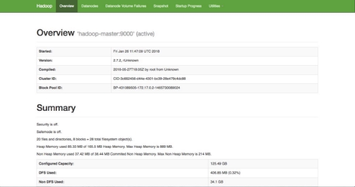
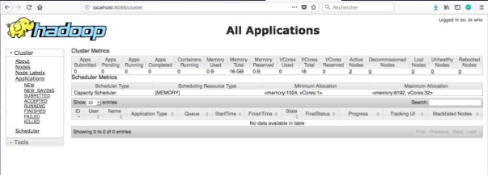

 

<br>

# Pratique de Hadoop n°01 : Start Hadoop

<br>

## <u>Sommaire</u>

- [I. Objectif du TP](#i-objectif-du-tp)
- [II. Hadoop et Docker](#ii-hadoop-et-docker)
- [III. Installation et configuration de l’image Docker](#iii-prise-en-main-de-hidora-et-des-dockers-hadoop)
- [IV. Description de la configuration](#iv-description-de-la-configuration)
    - [A. Avant-propos](#a-avant-propos)
	- [B. Configuration SSH](#b-configuration-ssh)
	- [C. Fichiers de configuration hadoop](#c-fichiers-de-configuration-hadoop)
	    - [1. Core-site.xml](#1-core-sitexml)
        - [2. hdfs-site.xml](#2-hdfs-sitexml)  
    	- [3. mapred-site.xml](#3-mapred-sitexml)
	- [D. Liens officiels des configurations des fichiers](#d-liens-officiels-des-configurations-des-fichiers)
- [V. Interfaces web pour Hadoop](#v-interfaces-web-pour-hadoop)

<div style="page-break-after: always;"></div>

## <u>I. Objectif du TP</u>

- Initiation au framework hadoop
- utilisation de docker  
- Lancer un cluster hadoop de 3 noeuds

<br>

## <u>II. Hadoop et Docker</u>

Pour déployer le Framework Hadoop, nous allons utiliser des conteneurs Docker. L'utilisation des conteneurs va garantir la consistance entre les environnements de développement et permettra de réduire considérablement la complexité de configuration des machines (dans le cas d'un accès natif) ainsi que la lourdeur d'exécution (si on opte pour l'utilisation d'une machine virtuelle).

<br>

## <u>III. Prise en main de Hidora et des dockers Hadoop</u>

Nous allons utiliser tout au long de ce TP trois conteneurs représentant respectivement :

- un noeud maître (Namenode)
- deux noeuds esclaves (Datanodes)

<br>

## <u>IV. Description de la configuration</u>

### **A. Avant-propos**

Ce chapitre est une explication très technique (avec des commandes linux).

C’est pour votre connaissance informatique.

<div style="page-break-after: always;"></div>

### **B. Configuration SSH**

Hadoop nécessite un accès SSH pour gérer les différents nœuds. Bien que nous soyons dans une configuration simple nœud, nous avons besoin de configurer l'accès vers localhost pour l'utilisateur **hduser** que nous venons de créer précédemment.

Avant tout, nous devons générer une clé SSH pour l'utilisateur hduser.

```shell
$ ssh-keygen -t rsa -P ""

Generating public/private rsa key pair.

Enter file in which to save the key (/home/hduser/.ssh/id\_rsa):

Created directory '/home/hduser/.ssh'.

Your identification has been saved in /home/hduser/.ssh/id\_rsa.

Your public key has been saved in /home/hduser/.ssh/id\_rsa.pub.

The key fingerprint is:

80:36:b8:8d:04:32:d2:d2:d8:ef:02:ff:01:a4:c5:63 hduser@precise64

The key's randomart image is:

**+-[RSA 2048]-+**
**|=\*         |**
**|=oE. .      |**
**| \*oo+ .    |**
**|o..=.. .    |**
**| ooo.   S   |**
**|  o o       |**
**|   o .      |**
**|    .       |**
**|            |**
**+------------+**
```

<div style="page-break-after: always;"></div>

Cette commande va créer une clé **RSA** avec un mot de passe vide. Dans notre cas de virtualisation, l'absence de mot de passe n'a pas d'importance. Assurez-vous d'en fixer un si votre serveur est accessible depuis l'extérieur.

Vous devez ensuite autoriser l'accès au SSH de la machine avec cette nouvelle clé fraîchement créée.

**cat ~/.ssh/id\_rsa.pub >> ~/.ssh/authorized\_keys**

La dernière chose à réaliser est de tester la connexion SSH à partir de l'utilisateur hduser.

```shell
$ ssh localhost

The authenticity of host 'localhost (127.0.0.1)' can't be established.

ECDSA key fingerprint is 11:5d:55:29:8a:77:d8:08:b4:00:9b:a3:61:93:fe:e5.

Are you sure you want to continue connecting (yes/no)? yes

Warning: Permanently added 'localhost' (ECDSA) to the list of known hosts.

Welcome to Ubuntu 12.04 LTS (GNU/Linux 3.2.0-23-generic x86\_64)

*Documentation:  https://help.ubuntu.com/

Welcome to your Vagrant-built virtual machine.

Last login: Sat Dec 14 20:19:33 2013 from 127.0.0.1

hduser@precise64:~$
```

<br>

### **C. Fichiers de configuration hadoop**

**<u>Tout d’abord :</u>**

Tous les fichiers de configuration d'Hadoop sont disponibles dans le répertoire **/etc/hadoop/conf**.

Les fichiers de configuration d'Hadoop fonctionnent sur le principe de clé/valeur : la clé correspondant au nom du paramètre et valeur à la valeur assignée à ce paramètre. Ces fichiers de configuration utilisent le format XML. Les nouveaux paramètres sont à ajouter entre la balise **<configuration> … </configuration>.**

Je ne peux être exhaustif sur les modifications à apporter sur ces fichiers de configuration. Je me limiterai donc aux paramètres de base pour exécuter un cluster Hadoop d'un nœud. Pour plus d'informations sur les paramètres autorisés, je vous invite à consulter les liens que je donnerai pour chaque fichier modifié.

<div style="page-break-after: always;"></div>

#### 1. Core-site.xml

**<u>Exemple :</u>**

Depuis le fichier **/etc/hadoop/conf/core-site.xml** modifier le contenu afin d'obtenir le résultat ci-dessous :

```shell
<configuration>
   <property>
      <name>fs.defaultFS</name>
      <value>hdfs://localhost:9000</value>
      <description>The name of the default filesystem.</description>
   </property>
</configuration>
```

La propriété **fs.defaultFS** (avant : fs.default.name) permet de spécifier le nom du système de fichier. Ainsi tous les répertoires et fichiers HDFS sont préfixés par **hdfs://localhost:9000**.

**<u>Précision :</u>**

La propriété **hadoop.tmp.dir** pointe par défaut sur le

répertoire **/tmp/hadoop-${user.name}**. Vous retrouvez donc dans ce répertoire **(/tmp/hadoop-${user.name}**) tous les sous-répertoires nécessaires au stockage des données pour **Hadoop (Namenode, Datanode…)**.

<br>

#### 2. hdfs-site.xml

Le fichier **/etc/hadoop/conf/hdfs-site.xml** contient les paramètres spécifiques au système de fichiers HDFS.

```shell
<configuration>
   <property>
      <name>dfs.replication</name>
      <value>1</value>
   </property>
   <property>
      <name>dfs.webhdfs.enabled</name>
      <value>true</value>
   </property>
</configuration>
```

Le paramètre **dfs.replication** permet de préciser le nombre de réplication d'un block. La valeur sera 1 puisque notre cluster ne se compose que d'un nœud. Finalement le paramètre **dfs.webhdfs.enabled** permet d'activer le service Web REST HDFS.

<div style="page-break-after: always;"></div>

#### 3. mapred-site.xml

Le fichier **/etc/hadoop/conf/mapred-site.xml** contient les paramètres spécifiques à MapReduce.

Depuis la version 2.x d'Hadoop avec l'arrivée de **Yarn**, ce fichier de configuration est épaulé par **yarn-site.xml**. Ainsi, si vous souhaitez utiliser **Yarn** comme implémentation de MapReduce, il faudra configurer le fichier **mapred- site.xml** comme présenté ci-dessous.

```shell
<configuration>
   <property>
      <name>mapreduce.framework.name</name>
      <value>yarn</value>
   </property>
</configuration>
```

<br>

### **D. Liens officiels des configurations des fichiers**

- [core-site.xml ](http://hadoop.apache.org/docs/current/hadoop-project-dist/hadoop-common/core-default.xml)
- [hdfs-default.xml ](http://hadoop.apache.org/docs/current/hadoop-project-dist/hadoop-hdfs/hdfs-default.xml)
- [mapred-site.xml ](http://hadoop.apache.org/docs/stable/hadoop-mapreduce-client/hadoop-mapreduce-client-core/mapred-default.xml)
- [yarn-default.xml ](http://hadoop.apache.org/docs/r2.3.0/hadoop-yarn/hadoop-yarn-common/yarn-default.xml)

<div style="page-break-after: always;"></div>

## <u>V. Interfaces web pour Hadoop</u>

Comme vous le savez : Hadoop offre plusieurs interfaces web pour pouvoir observer le comportement de ses différentes composantes. Vous pouvez afficher ces pages en local sur votre machine grâce à l'option -p de la commande **docker run**. En effet, cette option permet de publier un port du conteneur sur la machine hôte. Pour pouvoir publier tous les ports exposés, vous pouvez lancer votre conteneur en utilisant l'option -P.

En regardant le contenu du fichier **start-container.sh** fourni dans le projet, vous verrez que deux ports de la machine maître ont été exposés:

- Le port 9070: qui permet d'afficher les informations de votre namenode.
- Le port 8088: qui permet d'afficher les informations du Resource Manager de Yarn et visualiser le comportement des différents jobs.

Une fois votre cluster lancé et prêt à l'emploi, vous pouvez, sur votre navigateur préféré de votre machine hôte, aller à : http://localhost:9070. Vous obtiendrez le résultat suivant:



<br>

Vous pouvez également visualiser l'avancement et les résultats de vos Jobs (Map Reduce ou autre) en allant à l'adresse: [http://localhost:8088](http://localhost:8088/)


