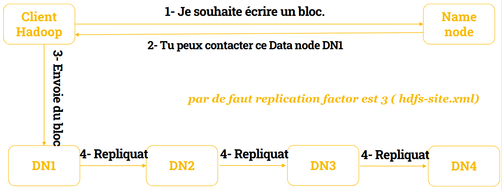

 

# HDSF (HaDoop File System)

## <u>Introduction HDFS</u>

- Ce système de fichiers est distribué sur des centaines voire des milliers de serveurs, et chaque nœud stocke une partie du système fichier. Pour éviter le risque de perdre des données, chaque donnée est stockée à trois emplacements.
- Il est très adapté au Big Data. Des dizaines de millions de fichiers peuvent être supportés sur une seule instance. Par ailleurs, cela assure la cohérence et l’intégrité des données pour éviter tout désagrément.
- HDFS est connu par sa portabilité. Il peut fonctionner sur différents types de commodity hardwares sans aucun problème de compatibilité.
- Plus qu’une base de données, ce système de fichier distribué se présente comme une Data Warehouse. Il est impossible de déployer un langage de requête sur HDFS, et les données sont accessibles par le biais de fonction de mapping et de réduction ( Hadoop MapReduce ). Les données adhèrent à un modèle de cohérence simple et robuste.

 

### **Présentation de HDFS**

- HDFS est le système de fichiers de Hadoop.
- Comme tout système de fichiers, HDFS a vocation à être accédé à la fois :

  - pour écrire,
  - pour interroger,
  - pour lire les données qui y sont stockées.

- Cependant, on ne va jamais l'interroger en direct.
- En effet, Hadoop possède une couche d'abstraction nommée HaDoopFS qui permet d'interroger, de lire et d'écrire des données directement dans un système de fichiers.
- Cette couche d'abstraction a le gros avantage d'avoir plusieurs backend et plusieurs frontend.
- En backend, on entend les systèmes de fichiers supportés.

 

### **Accès à HDFS**

- Ainsi, HadoopFS va permettre d'accéder à la fois à l'HDFS, mais également aux fichiers locaux,
- Et par exemple : à Amazon S3, aux fichiers stockés sur un FTP, à OpenStack Swift, à OrangeFS, Windows Azure, Cassandra, CephFS, le Google Storage, MapR-FS ou Quantcast ….
- Tous ces backend vont être gérés avec les mêmes interfaces, et ainsi un logiciel qui va utiliser HadoopFS, va pouvoir accéder aux données quel que soit le système de fichiers sur lequel elles sont stockées.
- Et ainsi, un outil qui utilise HadoopFS, va pouvoir accéder aux données quel que soit le système de fichiers utilisé.

 

### **Comment utiliser HDFS**

- Pour ce faire, on va utiliser des URL, des URI exactement, des « Unique Resource Identifier » et des « Unique Resource Location », pour savoir où les données sont stockées.
- A chaque fois, on va avoir donc, un protocole qui va définir le type de système de fichiers
- Ainsi, si on veut parler de l'HDFS, on va avoir notre URI qui va commencer par hdfs://, tout comme si on veut parler d'une ressource sur le système de fichiers local, on va utiliser file://.
- Je vous encourage vivement à toujours utiliser HaDoopFS sans spécifier le protocole afin de laisser la possibilité à l'utilisateur de votre application de le faire.
- Cela permettra que tous vous outils fonctionnent maintenant avec HaDoopFS, puissent fonctionner quel que soit le système de fichiers derrière.

 

### **API HDFS**

- HaDoopFS met donc à disposition diverses API
- C'est-à-dire qu'on va pouvoir y accéder par exemple en ligne de commande, pour pouvoir interroger le système de fichiers quel qu'il soit ou via une API Java (ou aussi une API dans notre cas en Python avec une API JAVA)
- Qui permet de créer d'écrire, de modifier, de supprimer des fichiers.
- Via une librairie C, qui est en fait construite grâce à JNI, Java Native Interface, qui permet d'avoir les méthodes Java accessibles directement en C. Via Thrift, un protocole directement pour accéder aux données, qui est propre à Apache.
- Ou encore via Fuse par exemple, pour le monter dans l'espace utilisateur, ou en WebDAV, pour l'interroger, par exemple, grâce à une API HTTP.

## <u>PRINCIPES HDFS</u>

### **Caractéristiques de HDFS**

- Les caractéristiques de HDFS sont par exemple,
- Concernant la Réplication : La Réplication est le fait d'avoir les données accessibles à plusieurs endroits simultanément.
- Cette Réplication, sur l'HDFS, se fait par blocs.
- C'est à dire que ce sont les blocs, non pas les fichiers, qui sont accessibles à plusieurs endroits simultanément.
- Elles ne concernent bien entendu que les fichiers.

 

### **Caractéristiques de HDFS : Réplication**

- En effet, les dossiers, à proprement parler, n'existent que dans l'index.
- Par défaut, l'HDFS a un ratio de Réplication de 3.
- C'est à dire que chaque bloc de chaque fichier doit être à trois endroits simultanément.
- Cependant, il peut être personnalisable par fichier, ou par répertoire, grâce à la commande HDFS : **dfs setrep**.
- Il peut ainsi donc être ajusté en fonction des besoins, notamment si la donnée doit être plus répliquée
- Par exemple parce qu'elle est sensible, ou pour augmenter les performances en lecture, ou moins répliquée, parce qu'elle consomme beaucoup trop d'espace de stockage pour sa criticité.

 

### **Caractéristiques de HDFS : Sous-Réplication**

- On peut avoir des cas de sous-réplication, c'est à dire qu'à un moment donné, il n'existe pas assez de réplicas d'un même bloc
- Dans ce cas-là, le système essaye de le corriger au plus vite, et des cas de sur réplication
- C'est à dire qu'à un moment donné, trop de réplicas existent pour un même bloc, auquel cas, le système HDFS le corrige également au plus vite, simplement en supprimant un ou plusieurs réplicas.
- Le nombre de réplicas est visible dans chacune des interfaces, que ce soit l'interface web ou la ligne de commande. On a également la notion de Block Size.

 

### **Caractéristiques de HDFS : Block Size**

- Le Block Size étant la taille d'un bloc.
- Toutes les données étant stockées par bloc, l'espace de stockage étant découpé par blocs, ce paramètre peut être modifié, et doit être initialisé à l'instanciation du cluster.
- Il est forcément le même pour tout le cluster et pour tous les fichiers.
- Plus le Block Size est gros, plus cela est adapté pour les gros fichiers et les fichiers peu nombreux.
- Plus il est faible, plus c'est adapté pour les petits fichiers et les fichiers très nombreux, et plus cela limite le surcoût, à proprement parler, de travailler par blocs.
- L'HDFS supporte également nativement la Compression. Ça veut dire que tout ce qui est écrit ou lu de l'HDFS peut être compressé ou décompressé à la volée.

 

### **Caractéristiques de HDFS : CODECS de compression**

- On va passer par des codecs de compression, soit écrits en Java, soit natifs directement sur le système s'ils sont disponibles.
- Bien entendu, compresser réduit l'espace de stockage nécessaire pour stocker les données et augmente de ce fait les vitesses de transfert, également, puisque moins de données à transférer.
- Par contre, cela induit une charge CPU supplémentaire, et en plus, empêche les données de pouvoir être « splittées », c’est-à-dire découpées en plusieurs parties.
- Différents codecs de compression sont disponibles, on va retrouver notamment Gzip, Bzip2, Snappy et LZO.
- Chaque codec ayant ses avantages et ses inconvénients en fonction de nos besoins.

 

### **Caractéristiques de HDFS : Permissions**

- l'HDFS a également un système de permission.
- De façon similaire à ce qu'on retrouve sous Linux, chaque fichier et répertoire a un propriétaire et un groupe.
- Les trois sont alors définis pour le propriétaire, le groupe et les autres, et à chaque fois, pour la lecture, l'écriture et la traversée du répertoire.
- On a également un stick-bit pour les répertoires et l'HDFS supporte les ACL POSIX pour avoir des permissions plus fines avec par exemple getfacl.
- Le système de permission peut se désactiver pour l'intégralité de l'HDFS mais dans ce cas-là, il peut cependant être nécessaire, toujours, d'utiliser le SuperUser qui est le user HDFS par défaut. Ce système de permission va de paire avec un système d'Authentification qui se fait soit de façon simple avec un login mot de passe, soit via Kerberos.

## <u>Hadoop/HDFS SERVICES</u>

### **Caractéristiques de HDFS : Fonctionnement**

- L'HDFS fonctionne grâce à deux types de service, le NameNode et un ou plusieurs DataNode.
- Les DataNodes vont être là où vont être stockés les données.
- Il peut donc s'agir de serveurs totalement différents avec de le hardware totalement différent avec un ou plusieurs disques, il faut juste éviter d'avoir des raids sur les DataNodes.
- Les DataNodes vont stocker les données, données qui sont répliquées, c'est-à-dire que la même donnée, par exemple A va se retrouver à plusieurs endroits et qui sont stockées par blocs. A, B, C, D, E, F et G sont, de ce fait-là, des blocs.

 

### **Caractéristiques de HDFS : Le NameNode**

- Le NameNode quant à lui va avoir l'index des fichiers
- Il va savoir qu'il y a un fichier /totaux.txt qui va être composé des blocs A, B, C et D.
- Nous n'avons pas de blocs partiels, juste les blocs peuvent être vides sur leur fin, si jamais le fichier ne le remplit pas entièrement.
- C'est le NameNode qui va également avoir la structure hiérarchique des répertoires.
- Par ailleurs, le NameNode va savoir quels blocs sont sur quels serveurs.
- Ainsi, il va savoir que le bloc A est présent à la fois sur le DataNode 1 et 2, le bloc B sur le DataNode 1 et 3, etc…
- Toutes les métadonnées sont stockées physiquement sur le disque système dans deux types de fichiers spécifiques : edits_xxx et fsimage_xxx.
- Chaque cluster comporte un Namenode individuel faisant office de serveur principal. Ainsi, les clients peuvent accéder aux bonnes données au bon moment. Le Namenode se charge également d’ouvrir, fermer, renommer les fichiers ou même les dossiers. Chaque nœud comporte également un ou plusieurs Datanode, auquel est assignée la tâche de gérer le stockage associé au nœud. Les blocs sont cartographiés par le Namenode pour les Datanodes.

|  |  |
| --------------------------- | --------------------------- |
|                             |                             |

 

### **Caractéristiques de HDFS : La communication**

- Il y a, une communication permanente entre les DataNodes et le NameNode afin d'informer les uns et les autres de qui possède quel bloc.
- Le NameNode stocke ces données-là, les métadatas dans un fichier appelé le FS Image et va stocker les modifications au fur et à mesure de la vie du NameNode dans un EditLog qui est un journal des modifications.
- Ce dernier a tendance à grossir avec la vie du NameNode et il est mergé directement dans le FS Image au démarrage du NameNode.
- Le NameNode peut se mettre en SafeMode :
  - Dans ce cas-là, c'est un mode simplement où tout est accessible uniquement en lecture seule, qui se met généralement soit au démarrage,
  - Le temps qu'il se connecte à tous les DataNodes, ou à la demande d'un administrateur ou en cas de soucis afin de faciliter le débogage.
  - Il possède également un mode Recovery interactif permettant de contrôler plus précisément ce qui se fait dessus.

 

### **Caractéristiques de HDFS : Name node**

- La position des blocs dans les Data nodes est reconstruite à chaque démarrage du Namenode dans un mode appelé safe mode.
- Le safe mode bloque l'écriture sur HDFS, car le Name node charge les fichiers edits_xxx et fsimage_xxx et attend le retour des Data nodes sur la position des blocs.
- Le Name node charge tout en mémoire, chaque fichier, répertoire et bloc dans HDFS est représenté comme un objet dans la mémoire et occupe 150 octets.

 

### **Caractéristiques de HDFS : Data node**

- Il contient les blocs de données et sont surnommés les Workers.
- Les Data nodes sont sous les ordres du Name Node:
- En lecture, les Data nodes vont transmettre au client les blocs correspondant au fichier à transmettre.
- En écriture, les Data nodes vont retourner l'emplacement des blocs fraîchement créés.
- Les Data nodes sont également sollicités lors de l'initialisation du Name node et aussi de manière périodique, afin de retourner la liste des blocs stockés.

 

### **Caractéristiques de HDFS : Secondary Name node**

- Il vérifie périodiquement l'état du Name Node principal et copie les métadonnées via les fichiers : edits_xxx et fsimage_xxx.
- Si le Name Node principal est indisponible, le Name Node secondaire prend sa place.

|   |  |
| ------------------------ | --------------------------- |
|  |       |

## <u>Opérations HDFS</u>

|  |  |
| ---------------- | -------------------- |
|                  |                      |

La réplication est configurée dans le fichier: HDFS-site.xml

 

### **Caractéristiques de HDFS : Opérations**

- Quelques exemples d’opérations :
- **Démarrage de HDFS**

  - Au départ, vous devez formater le système de fichiers HDFS configuré, ouvrir namenode (serveur HDFS) et exécuter la commande suivante.  
    **hadoop namenode -format**

  - Après avoir formaté le HDFS, démarrez le système de fichiers distribué. La commande suivante démarrera le namenode ainsi que les nœuds de données en tant que cluster.  
    **start-dfs.sh**

- **Liste des fichiers dans HDFS**

  - Après avoir chargé les informations dans le serveur, nous pouvons trouver la liste des fichiers dans un répertoire, l'état d'un fichier, en utilisant ‘**ls**’. Voici la syntaxe **dels** que vous pouvez passer à un répertoire ou à un nom de fichier comme argument.  
    **$HADOOP_HOME/bin/hadoop fs -ls <args>**

- **Insertion de données dans HDFS**

  - Supposons que nous ayons des données dans le fichier appelé file.txt dans le système local qui doivent être enregistrées dans le système de fichiers hdfs. Suivez les étapes ci-dessous pour insérer le fichier requis dans le système de fichiers Hadoop.

  1. Étape 1
      - Vous devez créer un répertoire d'entrée.  
      **$HADOOP_HOME/bin/hadoop fs -mkdir /user/exemple1**

  2. Étape 2
      - Transférez et stockez un fichier de données des systèmes locaux vers le système de fichiers Hadoop à l'aide de la commande put.  
       **$HADOOP_HOME/bin/hadoop fs -put /home/file.txt /user/exemple1**

  3. Étape 3
      - Vous pouvez vérifier le fichier à l'aide de la commande ls.  
      **$HADOOP_HOME/bin/hadoop fs -ls /user/exemple1**

- **Récupération de données depuis HDFS**

  - Supposons que nous ayons un fichier en HDFS appelé outfile. Vous trouverez ci - dessous une démonstration simple pour récupérer le fichier requis à partir du système de fichiers Hadoop.

    1. Étape 1
        - Au départ, affichez les données de HDFS en utilisant cat commander.  
      **$HADOOP_HOME/bin/hadoop fs -cat /user/output/outfile**

    2. Étape 2
        - Récupérez le fichier de HDFS vers le système de fichiers local en utilisant get commander.  
      **$HADOOP_HOME/bin/hadoop fs -get /user/output/ /home/hadoop_tp/**

- **Arrêt HDFS**
  - Vous pouvez arrêter le HDFS à l'aide de la commande suivante.  
    **stop-dfs.sh**

## <u>Configurer HDFS</u>

### **Configuration de l'environnement**

- On verra la configuration l’environnement lors du TP sur l’utilisation de HDFS.
- Les images ont une configuration préétablie :
  - **$HADOOP_HOME,**
  - **JAVA_HOME …**
- On verra l’utilisation hdfs-site.xml :
- Le fichier contient des informations telles que la valeur des données de réplication, le chemin du namenode et les chemins du datanode de vos systèmes de fichiers locaux.
- Cela signifie l'endroit où vous souhaitez stocker l'infrastructure Hadoop.
  - [CF: doc officiel Hadoop HDFS](https://hadoop.apache.org/docs/stable/hadoop-project-dist/hadoop-hdfs/HDFSHighAvailabilityWithNFS.html)

- On verra l’utilisation core-site.xml :
- Le core-site.xml fichier contient des informations telles que le numéro de port utilisé pour l'instance Hadoop
- La mémoire allouée au système de fichiers, la limite de mémoire pour stocker les données et la taille des tampons de lecture / écriture..
  - [Cf doc officiel Hadoop HDFS](https://hadoop.apache.org/docs/stable/hadoop-project-dist/hadoop-hdfs/HDFSHighAvailabilityWithNFS.html)
- On verra l’utilisation yarn-site.xml :
- Ce fichier est utilisé pour configurer le fil dans Hadoop.
  - [Cf doc officiel Hadoop HDFS](https://hadoop.apache.org/docs/stable/hadoop-project-dist/hadoop-hdfs/HDFSHighAvailabilityWithNFS.html)

- On verra l’utilisation mapred-site.xml :
- Ce fichier est utilisé pour spécifier le Framework MapReduce que nous utilisons.
  - [Cf doc officiel Hadoop HDFS](https://hadoop.apache.org/docs/stable/hadoop-project-dist/hadoop-hdfs/HDFSHighAvailabilityWithNFS.html)

 

### **Caractéristiques de HDFS**

1. Configuration du nœud de nom
    - Configurez le namenode en utilisant la commande «hdfs namenode -format» comme suit.

2. Vérification des fichiers DFS Hadoop
    - La commande suivante est utilisée pour démarrer dfs. L'exécution de cette commande démarrera votre système de fichiers Hadoop.
    - start-dfs.sh

3. Vérification du script de fil
    - La commande suivante est utilisée pour démarrer le script de fil. L'exécution de cette commande démarrera vos démons yarn.
    - $ start-yarn.sh

4. Accéder à Hadoop sur le navigateur

    - Le numéro de port par défaut pour accéder à Hadoop est 50070.
    - Utilisez l'url suivante pour obtenir les services Hadoop sur le navigateur.
    - <http://localhost:50070/>

5. Vérifier toutes les applications pour le cluster

    - Le numéro de port par défaut pour accéder à toutes les applications du cluster est 8088.
    - Utilisez l'url suivante pour visiter ce service.
    - **<http://localhost:8088/>**

    

## <u>Démarrer HDFS</u>

- Après tout configurer, on peut démarrer le démon HDFS
- On démarre enfin de compte les démons HDFS, le namenode et le datanode, de façon à pouvoir accéder à HDFS, évidemment.
- Par exemple et on reverra ces points dans un des TP,

  dans le répertoire opt hadoop-2.8.1 et, à l'intérieur de ce répertoire,

  il y a un répertoire sbin qui va contenir un certain nombre de scripts de démarrage ou d'arrêt des différents démons des services, si vous voulez, de Hadoop.

- Nous avons un **start-dfs.sh** pour démarrer HDFS sur Linux.
- Nous avons un **start-dfs.cmd** pour Windows.
- Nous avons donc, évidemment, un **stop-dfs** pour Windows et pour Linux, on a compris et puis, ici, puisque j'ai tout fait en route, ce qui est entre nous en production n'est pas forcément une très bonne idée.
- Vous pourriez créer un utilisateur **hdfs**, lui donner les permissions dans les répertoires, exécuter les démons sous ce compte, etc, là j'ai fait simple.
- Je vais faire un **sudo** et je vais faire un **start-dfs.sh** évidemment.
- On me demande, ici, le mot de passe de root, on est passé en root donc je vais placer ici mon mot de passe root, pas celui de Rudy, pas mon utilisateur.
- On verra en pratiquant lors des TP.

## <u>Le cluster HDFS</u>

- Nous avons un **start-dfs.cmd** pour Windows.
- Nous avons donc, évidemment, un **stop-dfs** pour Windows et pour Linux, on a compris et puis, ici, puisque j'ai tout fait en route, ce qui est entre nous en production n'est pas forcément une très bonne idée.
- Vous pourriez créer un utilisateur hdfs, lui donner les permissions dans les répertoires, exécuter les démons sous ce compte, etc, là j'ai fait simple.
- Je vais faire un sudo et je vais faire un **start-dfs.sh** évidemment.
- On me demande, ici, le mot de passe de root, on est passé en root donc je vais placer ici mon mot de passe root, pas celui de Rudy, pas mon utilisateur.
- On verra en pratiquant lors des TP.
