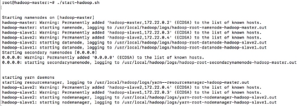
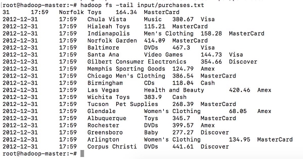
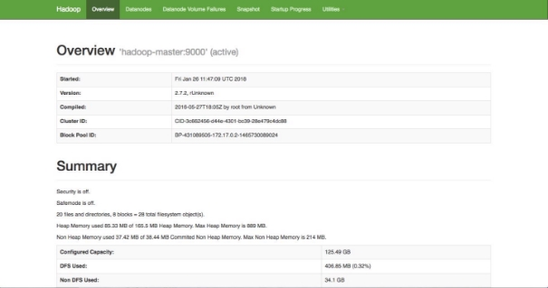
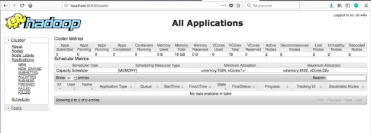

 

<br>

# TP n°02 : Le traitement Batch avec Hadoop HDFS

<br>

## <u>Sommaire</u>

<br>

- [I. Avant-Propos](#i-avant-propos)
- [II. Objectif du TP](#ii-objectif-du-tp)
- [III. Hadoop et Docker](#iii-hadoop-et-docker)
- [IV. Installation et configuration de l’image Docker](#iv-installation-et-configuration-de-limage-docker)
- [V. Mémo des commandes HDFS](#v-mémo-des-commandes-hdfs)
- [VI. Suite du TP : Manipulation des commandes HDFS](#vi-suite-du-tp--manipulation-des-commandes-hdfs)
- [VII. Interfaces web pour Hadoop](#vii-interfaces-web-pour-hadoop)

<div style="page-break-after: always;"></div>

## <u>I. Avant-Propos</u>

   **_Reprise du TP 01 Start Hadoop_**

<br>

## <u>II. Objectif du TP</u>

- Initiation au framework hadoop
- utilisation de docker
- Lancer un cluster hadoop de 3 noeuds.

<br>

## <u>III. Hadoop et Docker</u>

Pour déployer le Framework Hadoop, nous allons utiliser des conteneurs Docker. L'utilisation des conteneurs va garantir la consistance entre les environnements de développement et permettra de réduire considérablement la complexité de configuration des machines (dans le cas d'un accès natif) ainsi que la lourdeur d'exécution (si on opte pour l'utilisation d'une machine virtuelle).

<div style="page-break-after: always;"></div>

## <u>IV. Installation et configuration de l’image Docker</u>

Nous allons utiliser tout au long de ce TP une VM avec trois conteneurs représentant respectivement :

- un noeud maître (Namenode)
- deux noeuds esclaves (Datanodes)

1. ouvrez un terminal ou votre application pour faire une connexion SSH.

2. Entrez les informations fournis : nom_machine, pwd_machine, port_pulic de la machine associé au port privé 22 (SSH)

3. Entrer dans le conteneur master pour commencer à l'utiliser. **./bash_hadoop_master.sh** _(docker exec -it hadoop-master bash)_

   Le résultat de cette exécution sera le suivant:

**root@hadoop-master:~#**

Vous vous retrouverez dans le shell du namenode, et vous pourrez ainsi manipuler le cluster à votre guise. La première chose à faire, une fois dans le conteneur, est de lancer Hadoop et Yarn. Un script est fourni pour cela, appelé start-hadoop.sh.

Lancer ce script.

**./start-hadoop.sh**

Le résultat devra ressembler à ce qui suit:



Premiers pas avec Hadoop

Toutes les commandes interagissant avec le système Hadoop commencent par hadoop fs. Ensuite, les options rajoutées sont très largement inspirées des commandes Unix standard.

- Créer un répertoire dans HDFS, appelé input. Pour cela, taper: `hadoop fs –mkdir -p input`

> <span style="color:red">Si vous avez une erreur :</span>

Si pour une raison ou une autre, vous n'arrivez pas à créer le répertoire input, avec un message ressemblant à ceci: ls: '.': No such file or directory, veiller à construire l'arborescence de l'utilisateur principal (root), comme suit: `hadoop fs -mkdir -p /user/root`

<div style="page-break-after: always;"></div>

## <u>V. Mémo des commandes HDFS</u>

Pour ces commandes, il existe 2 syntaxes possibles:

- Avec hadoop: avec une syntaxe du type `hadoop fs <commande>`,
- Avec hdfs: la syntaxe est `hdfs dfs <commande>`.

Ces commandes sont proche de celles utilisées par le Shell linux comme ls, mkdir, rm, cat, etc…

1. _Pour lister le contenu d’un répertoire_ : `hdfs dfs -ls <chemin du répertoire>`

   Par exemple:

   - `hdfs dfs -ls /`
   - `hdfs dfs -ls /user`, pour voir le contenu du répertoire "user"

   ```shell
   Found 2 items
   -rw-r--r--   1 hduser supergroup    3324334 2017-09-16 12:00 /user/135-0.txt
   -rw-r--r--   1 hduser supergroup    3359550 2017-09-16 12:01 /user/2600-0.txt
   ```

   - On peut utiliser aussi: `hadoop fs -ls /user`

2. _Pour afficher le contenu d’un fichier_ : `hdfs dfs -cat <chemin_src>`

   Par exemple:

   - `hdfs dfs -cat /user/135-0.txt`
   - On peut utiliser: `hadoop fs -cat /user/135-0.txt`

3. _Pour créer un répertoire_ : `hdfs dfs -mkdir <chemin_src>`

   Par exemple:

   - **hdfs dfs -mkdir /user/output**

4. _Pour copier un fichier sur HDFS_ : `hdfs dfs -put <chemin_src>  <chemin_dest_HDFS>`

   La commande suivante est réservé seulement au fichier locaux: `hdfs dfs -copyFromLocal <chemin_src> <chemin_dest_HDFS>`

   Par exemple:

   - `hdfs dfs -put TextFile.txt /user`
   - `hdfs dfs -copyFromLocal TextFile.txt /user`

   Avec hadoop:

   - `hadoop fs -put <chemin_src>  <chemin_dest_HDFS>`
   - `hadoop fs -copyFromLocal <chemin_src> <chemin_dest_HDFS>`

5. Pour effectuer un copie de fichier : `hdfs dfs -cp <chemin_src> <chemin_dest_HDFS>`

   Par exemple:

   - `hdfs dfs -cp /user/TextFile.txt /user/output`
   - `hdfs dfs -cp /user/TextFile.txt /user/TestFile2.txt`

   Avec hadoop:

   - `hadoop fs -cp /user/TextFile.txt /user/output hadoop fs -cp /user/TextFile.txt /user/TestFile2.txt`

6. _Pour récupérer un fichier sur HDFS_ : `hdfs dfs -get <chemin_src> <chemin_dest_HDFS>`

   Par exemple:

   - `hdfs dfs -get /user/TextFile2.txt`
   - `hdfs dfs -get /user/TextFile2.txt LocalTextFile2.txt`

   Cette syntaxe est réservée aux fichiers locaux:

   - `hdfs dfs -copyToLocal /user/TextFile2.txt`
   - `hadoop fs -get /user/TextFile2.txt`
   - `hadoop fs -copyToLocal /user/TextFile2.txt`

   Les mêmes syntaxes existent pour effectuer des déplacements:

   - _pour déplacer de HDFS  vers le volume local_ : `hdfs dfs -moveToLocal`
   - _pour déplacer du  volume local vers HDFS_ : `hdfs dfs -moveFromLocal`
   - _pour effectuer des déplacements  dans HDFS_ : `hdfs dfs -mv`

7. _Pour supprimer un fichier_

   - `hdfs dfs -rm <chemin_dest_HDFS>`

   Par exemple:

   - `hdfs dfs -rm /user/TextFile2.txt`
   - `Deleted /user/TextFile2.txt`
   - `hadoop fs -rm /user/TextFile2.txt`

8. _Pour supprimer un répertoire_

   Si le répertoire est vide, on peut utiliser comme sur  le Shell rmdir:

   - `hdfs dfs -rmdir <chemin_dir_empty>`

   Par exemple:

   - `hdfs dfs -rmdir /user/output2`

   Si le répertoire contient des fichiers:

   - `hdfs dfs -rm -r <chemin_dir>`

   Par exemple:

   - `hdfs dfs -rm -r /user/output`

   Avec hadoop:

   - `hadoop fs -rmdir /user/output2`
   - `hadoop fs -rm -r /user/output`

<div style="page-break-after: always;"></div>

## <u>VI. Suite du TP : Manipulation des commandes HDFS</u>

1. Nous allons utiliser le fichier **purchases.txt** comme entrée pour les futurs traitements MapReduce. Ce fichier se trouve déjà sous le répertoire principal de votre machine master.
2. Charger le fichier purchases dans le répertoire input que vous avez créé:

   `hadoop fs –put purchases.txt input`

3. Pour afficher le contenu du répertoire input, la commande est:

   `hadoop fs –ls input`

4. Pour afficher les dernières lignes du fichier purchases:

   `hadoop fs -tail input/purchases.txt`

5. Le résultat suivant va donc s'afficher:

   

<div style="page-break-after: always;"></div>

## <u>VII. Interfaces web pour Hadoop</u>

Comme vous le savez : Hadoop offre plusieurs interfaces web pour pouvoir observer le comportement de ses différentes composantes. Vous pouvez afficher ces pages en local sur votre machine grâce à l'option -p de la commande **docker run**. En effet, cette option permet de publier un port du conteneur sur la machine hôte. Pour pouvoir publier tous les ports exposés, vous pouvez lancer votre conteneur en utilisant l'option -P.

En regardant le contenu du fichier **start-container.sh** fourni dans le projet, vous verrez que deux ports de la machine maître ont été exposés:

- Le port 9070: qui permet d'afficher les informations de votre namenode.
- Le port 8088: qui permet d'afficher les informations du Resource Manager de Yarn et visualiser le comportement des différents jobs.

Une fois votre cluster lancé et prêt à l'emploi, vous pouvez, sur votre navigateur préféré de votre machine hôte, aller à : [http://localhost:9070](http://localhost:9070/). Vous obtiendrez le résultat suivant:



Vous pouvez également visualiser l'avancement et les résultats de vos Jobs (Map Reduce ou autre) en allant à l'adresse: [http://localhost:8088](http://localhost:8088/)


