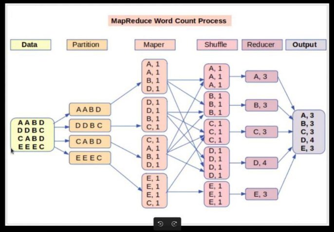
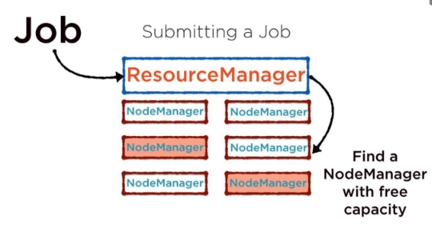
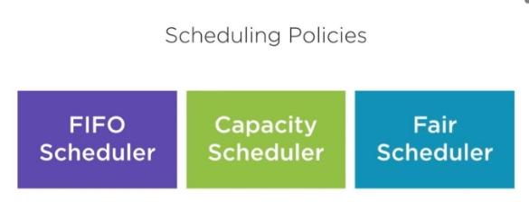
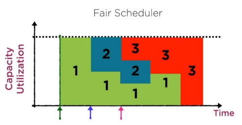

 

# Les Bases de MR et YARN

 

## <u>MapReduce</u>

 

### **Présentation de MapReduce (MR)**

- MapReduce est le modèle de programmation du framework Hadoop. Il permet d'analyser les immenses volumes de données Big Data grâce au traitement parallèle.
- L’intérêt de MapReduce est de faciliter le traitement concurrent des données. Pour parvenir à cette prouesse, les volumes massifs de données, de l’ordre de plusieurs petabytes, sont décomposés en plusieurs parties de moindres envergures.
- Ces morceaux de données sont traités en parallèle, sur les serveurs Hadoop. Après le traitement, les données en provenance des multiples serveurs sont agrégées pour renvoyer un résultat consolidé à l’application.
- L’accès et le stockage des données sont basés sur disque. Les » input » (entrées) sont stockées sous forme de fichiers contenant des données structurées, semi-structurées ou non structurées. Le » output » (sortie) est aussi stockée sous forme de fichiers
- Le fonctionnement de MapReduce s’articule principalement autour de deux fonctions : Map, et Reduce. Ces fonctions sont séquencées l’une après l’autre.

  **Map** sert à décomposer et à cartographier les données.  
  **Reduce** mélange et réduit les données.

  

 

### **Fonction de Map**

- Les données d’input sont décomposées en blocs de moindre envergure. Chacun de ces blocs est assigné à un « mapper » pour le traitement.
- Le framework Hadoop se charge de décider automatiquement combien de mappers utiliser. Ce choix dépend de la taille des données à traiter et des blocs de mémoire disponibles sur chaque serveur.
- La fonction Map reçoit l’input à partir du disque sous forme de paires « clé/valeur ». Ces paires sont traitées, et un autre ensemble de clé/valeur intermédiaire est produit.

_Prenons l’exemple d’un fichier contenant 100 enregistrements à traiter. Il est possible d’utiliser 100 mappers simultanément pour traiter chaque enregistrement séparément. Toutefois, on peut aussi confier plusieurs enregistrements à chaque mapper._

 

### **Fonction de Reduce**

- Après que tous les mappers aient terminé leurs tâches de traitement, le framework mélange et organise les résultats. Il les transmet ensuite aux « reducers ». **_Précisons qu’un reducer ne peut démarrer si un mapper est encore actif._**
- La fonction Reduce reçoit aussi les inputs sous forme de paires clé/valeur.
- Toutes les valeurs produites par map ayant la même clé sont assignées à un reducer unique. Celui-ci se charge d’agréger les valeurs pour cette clé.
- Reduce produit ensuite un ouput final, toujours sous forme de paie clé/valeur.
- Toutefois, le type de clés et de valeurs varie selon les cas d’usage. Tous les inputs et outputs sont stockés dans le HDFS.

 

### **Fonction de MapReduce**

 

### **Fonction de combiner et partionner**

- Il existe des étapes intermédiaire sentre Map et Reduce appelée Combine et partionne.
- Le processus Combine permet d’exécuter un » reducer » individuellement sur chaque serveur » mapper « . Il permet de réduire davantage les données sur chaque mapper, dans une forme simplifiée.
- L’étape de Partition permet de traduire les paires » clé valeur « produites par les mappers en un autre ensemble de paires clé valeur avant de les transmettre au reducer.
- Le nombre de partitions est égal au nombre de reducers. Dès que le partitionnement est complet, les données en provenance de chaque partition sont envoyées à un reducer spécifique.

## <u>YARN</u>

 

### **Présentation de Yarn**

- Les initiales YARN désignent le terme » Yet Another Resource Negotiator « . Cette technologie est devenue un sous-projet de Apache Hadoop en 2012, et a été ajoutée comme une fonctionnalité clé de Hadoop avec la mise à jour 2.0 déployée en 2013.
- Avant l’ajout de YARN, Hadoop ne pouvait exécuter que des applications MapReduce.
- YARN a donc beaucoup augmenté les cas d’usage potentiels du framework. En découplant la gestion des ressources et la planification du composant de traitement de données de MapReduce, YARN a également permis à Hadoop de prendre en charge d'avantage d’applications et de types de traitement différents.

 

### **Fonctionnement de Yarn**

- YARN est un gestionnaire de ressources centrale, un coordinateur d’application et un agent chargé de surveiller les opérations de traitement des différents noeuds de clusters.
- YARN est en mesure d’allouer les ressources aux applications de façon dynamique en fonction de leurs besoins.

 

- Yarn propose plusieurs méthodes de planification : FIFO Scheduler, Fair Scheduler, ou encore Capacity Scheduler.
- En outre, la fonctionnalité Reservation System permet aux utilisateurs de réserver des ressources de cluster en avance afin de s’assurer que les tâches de traitement importantes soient exécutées sans encombre.

|  |  |
| --------------------------- | -------------------------------------- |
|                             |                                        |

- Les stratégies est configurée sur yarn-site.xml.

