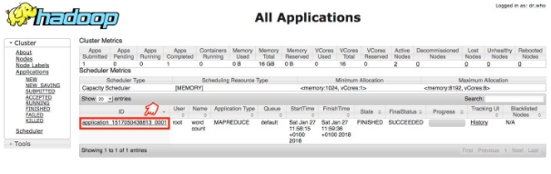
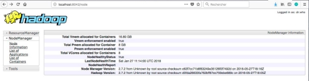

 

<br>

# TP n°03 : Map Reduce

<br>

## <u>Table des matières</u>

- [I. Objectif du TP](#i-objectif-du-tp)
- [II. Map Reduce](#ii-map-reduce)
  - [A. Présentation](#a-présentation)
  - [B. Wordcount](#b-wordcount)
    - [1. Création du projet en Python](#1-création-du-projet-en-python)
    - [2. Utilisation de notre Map-Reduce dans Hadoop](#2-utilisation-de-notre-map-reduce-dans-hadoop)
    - [3. Vérification par les outils Web d’Hadoop](#3-vérification-par-les-outils-web-dhadoop)
- [III. Exercice suite au TP](#iii-exercice-suite-au-tp)

<br>
<br>
<br>

## <u>I. Objectif du TP</u>

- Après le TP02\_Hadoop\_HDFS
- Initiation au Framework Hadoop et au patron MapReduce en Python

<div style="page-break-after: always;"></div>

## <u>II. Map Reduce</u>

### **A. Présentation**

Un Job Map-Reduce se compose principalement de deux types de programmes:

- Mappers : permettent d’extraire les données nécessaires sous forme de clef/valeur, pour pouvoir ensuite les trier selon la clef
- Reducers : prennent un ensemble de données triées selon leur clef, et effectuent le traitement nécessaire sur ces données (somme, moyenne, total...)

### **B. Wordcount**

Nous allons tester un programme MapReduce grâce à un exemple très simple, le WordCount, l'équivalent du HelloWorld pour les applications de traitement de données. Le Wordcount permet de calculer le nombre de mots dans un fichier donné, en décomposant le calcul en deux étapes:

- L'étape de Mapping, qui permet de découper le texte en mots et de délivrer en sortie un flux textuel, où chaque ligne contient le mot trouvé, suivi de la valeur 1 (pour dire que le mot a été trouvé une fois)
- L'étape de Reducing, qui permet de faire la somme des 1 pour chaque mot, pour trouver le nombre total d'occurrences de ce mot dans le texte.

#### 1. Création du projet en Python

Sur le master créer deux fichier python mapper et reducer comme suite :
   `docker exec -it hadoop-master bash`

Note: si votre conteneur n’est pas démarrer lancer la commande suivante :
   `docker restat hadoop-master`

<br>

> *Création du fichier mapper.py*

Vi mapper.py

```python
import sys import logging

logging.basicConfig(filename='debug.log',level=logging.DEBUG) logging.debug("Entering mapper.py")
for line in sys.stdin:
    logging.debug("Inside for loop " + line)
    line = line.strip()
    for word in line.split(" "):
        if len(word) > 0 :
            print("%s\t%i" %(word.lower(), 1))
```

<div style="page-break-after: always;"></div>

> *Création du fichier reducer.py*

Vi reducer.py

```python
import sys
import logging

logging.basicConfig(filename='debug.log',level=logging.DEBUG)

current_word = None
current_count= 0
word = None

print "Entering reducer.py"
for line in sys.stdin:
    line = line.strip()
    parts = line.split('\t', 1)
    if len(parts) < 2:
        continue
    word = parts[0]
    count = parts[1]
    try:
        count = int(count)
    except ValueError:
        continue

    if current_word == word:
        current_count += count
    else:
        if(current_word):
            print("%s\t%s" %(current_word,current_count))
        current_count = count
        current_word = word

if current_word == word:
    print("%s\t%s" %(current_word, current_count))
```

<br>

> *Tester notre code en local*

<u>Mapper uniquement en lançant la commande suivante</u>

`echo "bonjour bonsoir bonjour bonsoir" | python mapper.py`

Résultat :


<div style="page-break-after: always;"></div>

<u>Mapper et Reducer</u>

`echo "bonjour bonsoir bonjour bonsoir" | python mapper.py | python reducer.py`

Résultat :


<span style="color:red">Note:</span> N’oubliez pas que entre les deux fonctionnalités map et reduce, on le sort, lancer la commande suivante :`echo "bonjour bonsoir bonjour bonsoir" | python mapper.py | sort -k1,1 | python reducer.py`

Résultat :


<br>

#### 2. Utilisation de notre Map-Reduce dans Hadoop

- Lancer les services Hadoop : **./start-hadoop.sh**
- Suppression du dossier /output (à faire au cas où) : `hdfs dfs -rmdir /output`
- Vérifier si le fichier **hadoop-streaming-2.7.2.jar** existe bien dans le dossier :  
`ls $HADOOP_HOME/share/hadoop/tools/lib`
- S’il n’existe pas, télécharger le jar depuis internet et copier le dans le chemin : `$HADOOP_HOME/share/hadoop/tools/lib`
- <span style="color:red">Note :</span> si vous avez téléchargé le fichier sur votre machine
  - Copier les fichiers dans un dossier de partage sous Docker (dans un dossier hadoop par exemple)
  - `docker cp hadoop/ hadoop-streaming-2.7.2.jar hadoop-master:/root/ hadoop-streaming-2.7.2.jar`
- Lancer le mapper et le reducer sur hadoop avec le fichier purchases.txt :
  - `hadoop fs -mkdir /user/root/output`
  - `hadoop fs -mkdir /user/root/intput`
  - `hadoop fs -put purchases.txt /user/root/intput`
  - `hadoop jar $HADOOP\_HOME/share/hadoop/tools/lib/hadoop-streaming- 2.7.2.jar -file /root/mapper.py -mapper "python3 mapper.py" -file /root/reducer.py -reducer "python3 reducer.py" -input /user/root/input/purchases.txt -output /user/root/output/wordcount`
- Afficher le résultat stocké sur HDFS:  
`hadoop fs -tail output/ wordcount /part-00000`


<br>

#### 3. Vérification par les outils Web d’Hadoop

Il vous est possible de monitorer vos Jobs Map Reduce, en allant à la page: **<http://localhost:8088>**. Vous trouverez votre Job dans la liste des applications comme suit:



<div style="page-break-after: always;"></div>

Il est également possible de voir le comportement des noeuds esclaves, en allant à l'adresse: **<http://localhost:8041>** pour **slave1**, et **<http://localhost:8042>** pour **slave2**. Vous obtiendrez ce qui suit:



<br>

## <u>III. Exercice suite au TP</u>

- Écrire un Job **Map Reduce** permettant, à partir du fichier **purchases initial**, de déterminer le total des ventes par magasin.
- Écrire un Job **Map Reduce** permettant, à partir du fichier **purchases initial**, de déterminer le total des ventes, la moyenne des ventes et nombre des ventes par magasin.

La structure du fichier **purchases** est de la forme suivante:

| date | temps | magasin | produit | cout | paiement |
| ---- | ----- | ------- | ------- | ---- | -------- |

- Veiller à toujours tester votre code en local avant de lancer un job sur le cluster.
TP02 Hadoop Map reduce  Page : 8
