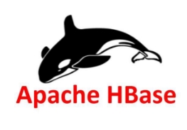
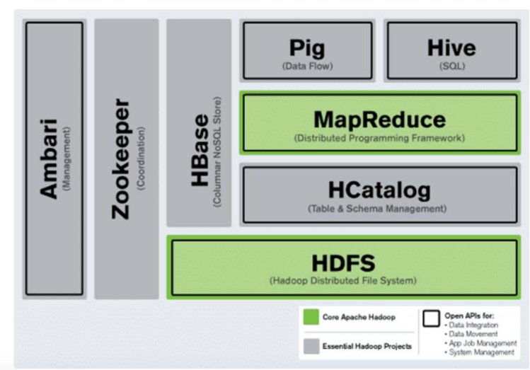
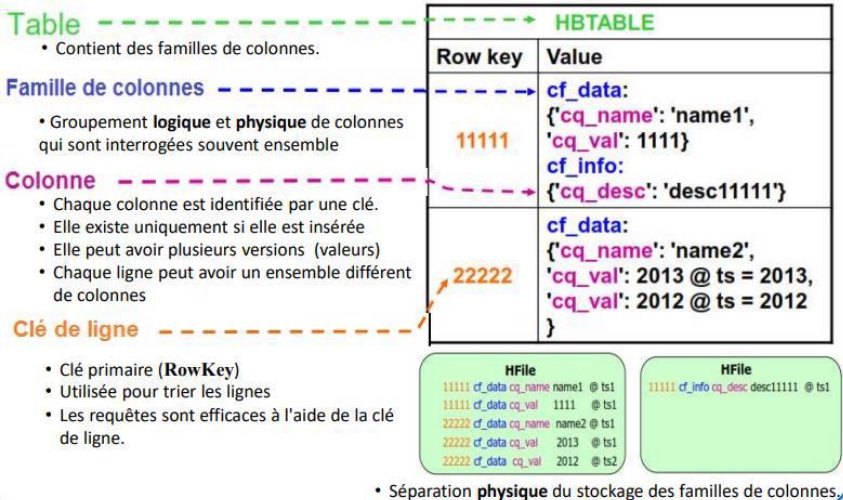
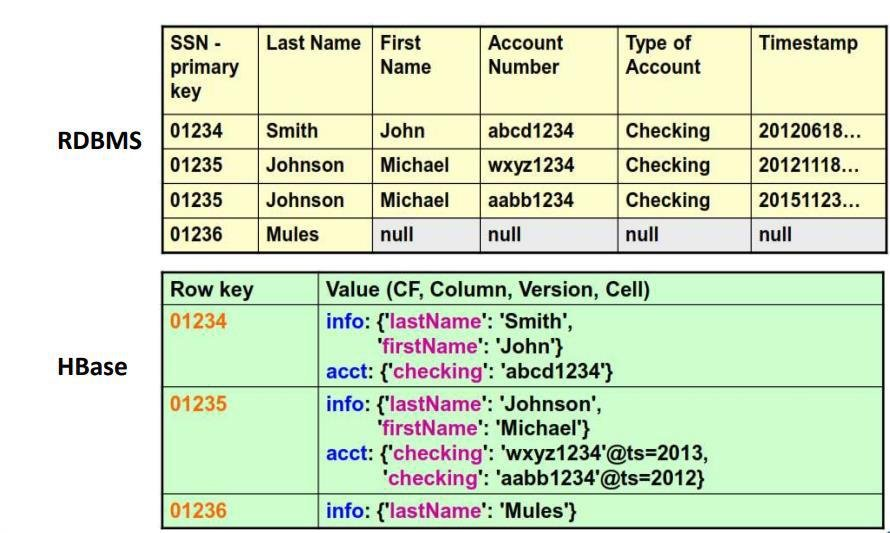
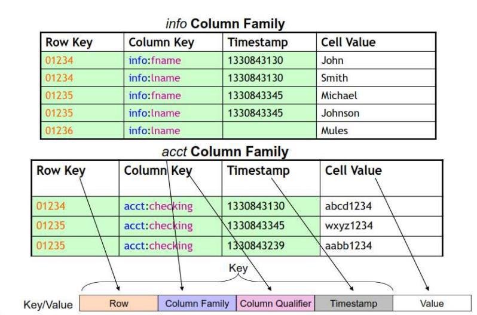
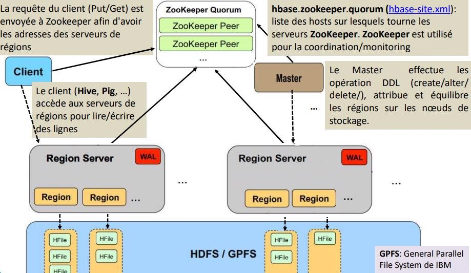
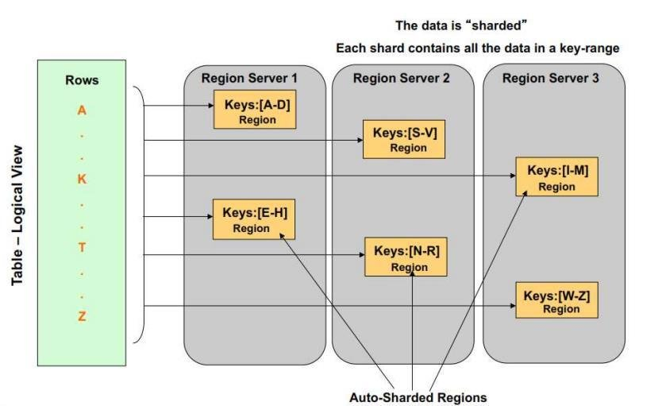

 

 

# HBase

 

## <u>HBase Introduction</u>

### **Pourquoi HBase ?**

- Les jeux de données sont de plus en plus importants : [Teraoctets](https://fr.wiktionary.org/wiki/t%C3%A9raoctet) au [Petaoctets](https://fr.wiktionary.org/wiki/p%C3%A9taoctet) ou plus
- Le « scale out » est aussi peu cher que le « scale in »
  - Par simple ajout d’une machine commode
  - Mais il arrive qu’Hadoop ne suffise pas
  - Nécessité de supporter l’écriture aléatoire et la lecture aléatoire  
**Les bases de données traditionnelles ne suffisent tout simplement plus !**

### **Caracteristiques HBase**

HBase est :

- Distribuée
  - Orientée colonne
  - Multidimensionnelle
- Haute Disponibilité
- Haute Performance
- Système de Stockage

### **Comment fonctionne HBase**

- Deux types de nœuds
  - **Master** et **RegionServer**
- Master (un à la fois)
  - Gère les opérations du cluster
    - Affectation, répartition de la charge, fractionnement
    - Hautes disponibilités avec Zookeeper
- RegionServer
  - Héberge les tables, exécute les lectures, écritures
  - Les Clients dialoguent directement avec eux pour les lectures / écritures

 

### **HBase Tables**

- Un cluster HBase est constitué d’un nombre quelconque de tables définies par l’utilisateur
- Schéma de la table ne définit que ses familles de colonnes
  - Chaque famille se compose d’un certain nombre de colonnes
  - Chaque colonne se compose d’un certain nombre de versions
  - Colonnes n’existent que lorsqu’ils sont insérés, pour les « NULL » elles sont libres
  - Tout sauf les noms de table / famille sont byte[]
  - Lignes d’une table sont triés et stockés de manière séquentielle
  - Les colonnes d’une famille sont triées et stockées de manière séquentielle

## <u>HBase Hadoop NoSQL</u>

### **Limites de Hadoop**

- Hadoop utilise HDFS pour le stockage de données volumineuses et MapReduce pour les traiter.
- Hadoop est conçu pour effectuer un traitement par lots (non interactif) et les données ne seront accessibles que de manière séquentielle.
- Dans plusieurs scénarios, le traitement séquentiel de fichiers volumineux génère d'autres fichiers également volumineux qui devraient également être traités de manière séquentielle.
- Une nouvelle solution est nécessaire pour pouvoir traiter de données volumineuses de façon assurer un accès aléatoire aux données.
- Plusieurs outils comme **HBase, Cassandra, couchDB, Dynamo et MongoDB** permettent de stocker une très grande quantité de données et d'y accéder de façon aléatoire.
- Ces outils utilisent des modèles de données différents et font partie des technologies de BD NoSQL.

 

### **NoSQL**

- NoSQL, alias "Not Only SQL", est un ensemble de technologies de BD introduites spécifiquement pour gérer des types et structures de BD très variés en Big Data où les données sont distribuées et disparates -> No Relational
- Il existe quatre types de BD (entrepôts, datastores) NoSQL qui peuvent être orientées :
  - Clé-valeur: MemcacheD, REDIS, Riak
  - Graphe: Neo4j et Sesame
  - Colonnes: Hbase, Cassandra et SimpleDB
  - Documents: MongoDB et CouchDB
- Les technologies NoSQL ne remplaceront pas les RDBMS ou les DW.

 

### **Pourquoi utiliser NoSQL ?**

- Technologie à coût raisonnable pour gérer de nouveaux volumes de données 
- Évolutivité horizontale plutôt que verticale 
- Flexibilité- Modèle de données sans schéma et dynamique
- Disponibilité – Architecture distribuée 
- Technologie à coût raisonnable pour gérer de nouveaux volumes de données
- Évolutivité horizontale plutôt que verticale
- Flexibilité- Modèle de données sans schéma et dynamique
- Disponibilité – Architecture distribuée

## <u>HBase Modèle de Données</u>

### **Modèle de Données**

 

### **Exemple**

- Les données sont stockées dans des tables HBase
- Les tables contiennent des lignes et des colonnes
- Chaque ligne est identifiée par une clé unique (RowKey)
- Les colonnes sont regroupées dans des familles de colonnes (Column family)
- Chacune des valeurs d'une cellule (ligne +colonne) a une version désignée par un horodatage (timestamp)
- Le schéma de table définit les familles de colonnes
  - On peut avoir un grand nombre variable de colonnes par ligne
  - (clé de ligne, clé de colonne, horodatage) -> valeur
  - Le tuple {ligne, colonne, version} spécifie exactement une cellule
- Les lignes sont rangées dans l'ordre lexicographique (ordre binaire des octets) de clés de lignes
- Il n'y a pas de schéma de table dans HBase
  - On doit préciser les familles de colonnes possibles.
  - Elles déterminent l'organisation du stockage physique sur disque.
  - Chaque ligne peut avoir différents ensembles de familles de colonnes.
- HBase est décrit comme un entrepôt de type Clé-Valeur
  
- Chaque clé-valeur a un horodatage qui désigne une version:
  - Modifier une colonne consiste à ajouter une nouvelle version

## <u>HBase Architecture</u>

- Vue Physique de cellules

- Architecture du Cluster

## <u>HBase Zookeeper</u>

- Zookeeper fournit un service de coordination
- Les métadonnées de mapping "Région-Serveur de région" sont gardées dans de méta-tables stockées dans Zookeeper.
- Les serveurs de régions envoient des pulsations (heartbeats) à ZK Le client trouve le serveur de région via ZK
- Le client écrit / lit directement depuis et vers les serveurs de régions
- Zookeeper s'assure qu'il ait un seul maitre en exécution.
- Le Maître consulte ZK pour connaître les serveurs de régions défaillants
- ZK assure la tolérance aux pannes dans l’architecture de HBase
- ZK doit être toujours démarré en premier: **sudo service zookeeper-server** status

 

### **De nouveau le Master**

- Il surveille toutes les instances du serveur de régions dans le cluster
- Il est responsable des modifications de schéma et d'autres opérations sur les métadonnées telles que la création de tables et de familles de colonnes
- Il assigne des régions aux serveurs de région et utilise Apache ZooKeeper pour cette tâche.
- Il équilibre la charge des régions sur les serveurs de régions. Il décharge les serveurs occupés et déplace les régions vers des serveurs moins occupés.
- A leur démarrage, les maîtres s'adressent à ZooKeeper. Le premier à y accéder devient actif (principal) et les autres passifs (backup)

 

### **De nouveau : Serveur de région**

- Le serveur de région met un ensemble de régions à la disposition des clients.
- Une région stocke les données d'une partie d'une table.
- Il y a plusieurs magasins (**Store**) dans une région
- Un magasin contient une famille de colonnes dans une région.
- Un magasin a un **Memstore** et un ensemble de **Hfile**
- Le **MemStore** est un tampon d'écriture en mémoire dans lequel **HBase** accumule des données avant une écriture permanente dans les **Hfiles**
- **WAL** (**Write-Ahead-Log**) stocke toutes les modifications des données. Il y a un **WAL** par serveur de région. Toutes les modifications des régions d’un serveur de région sont d'abord enregistrées dans le **WAL**

 

### **De nouveau : Région**

- Une région est une partition horizontale d'une table avec une ligne de début et une ligne de fin. (**taille par défaut: 256M**)
- Les régions sont l'élément de base de la disponibilité et de la distribution des tables.
- Une région est automatiquement divisée par le serveur de la région lorsqu'elle dépasse une taille spécifiée.
- Périodiquement, un équilibreur de charge déplace les régions dans le cluster pour équilibrer la charge.
- Lorsqu'un serveur de région est défaillant, ses régions seront réaffectées à d'autres serveurs de régions.

 

## <u>HBase Stockage des tables</u>

## <u>HBase Namespaces</u>

- Un namespace est un groupement logique de tables similaire à une BD ou un schéma dans SGBDR.
- Il y a des namespace prédéfinis dans HBase:
  - HBase: c'est un namespace système contenant les tables internes (meta, namespace) de HBase utilisées pour stocker les métadonnées.
  - default: les tables créées sans préciser leur namespace, sont créées par défaut dans le namespace default.
- Commandes:
  - Pour avoir la liste des namespaces: `list_namespace`
  - Pour créer un nouveau namespace: `create_namespace 'nom_namespace'`
  - Pour avoir la description d’un namespace: `describe_namespace 'nom_namespace'`

 

**<u>On doit supprimer toutes les tables du namespace avant de le supprimer.</u>**

- Pour supprimer un namespace :  
  `drop_namespace 'nom_namespace'`

- Créer une table dans un namespace  
  `create 'nom_namespace:nom_table', 'cf1', 'cf2', …`

- Lister les tables d’un namespace :  
  `list_namespace_tables 'nom_namespace'`

## <u>HBase Liens web sur les commandes</u>

### **Shell de HBase**

#### General Commands

- `status` - Provides the status of HBase, for example, the number of servers.
- `version` - Provides the version of HBase being used.
- `table_help` - Provides help for table-reference commands.
- `whoami` - Provides information about the user.

 

#### Data Definition Language

- `create` - Creates a table.
- `list` - Lists all the tables in HBase.
- `disable` - Disables a table.
- `is_disabled` - Verifies whether a table is disabled.
- `enable` - Enables a table.
- `is_enabled` - Verifies whether a table is enabled.
- `describe` - Provides the description of a table.
- `exists` - Verifies whether a table exists.
- `drop` - Drops a table from HBase.
- `drop_all` - Drops the tables matching the ‘regex’ given in the command.

 

#### Data Manipulation Language

- `put` - Puts a cell value at a specified column in a specified row in a particular table.
- `get` - Fetches the contents of row or a cell.
- `delete` - Deletes a cell value in a table.
- `deleteall` - Deletes all the cells in a given row.
- `scan` - Scans and returns the table data.
- `count` - Counts and returns the number of rows in a table.

 

- **Tutorialspoint :**  
  [HBase - Shell (tutorialspoint.com)](https://www.tutorialspoint.com/hbase/hbase_shell.htm)

- **Projet apache :**  
  [Apache HBase – Apache HBase™ Home](https://hbase.apache.org/)  
  [Apache HBase ™ Reference Guide](https://hbase.apache.org/book.html#_overriding_configuration_starting_the_hbase_shell)