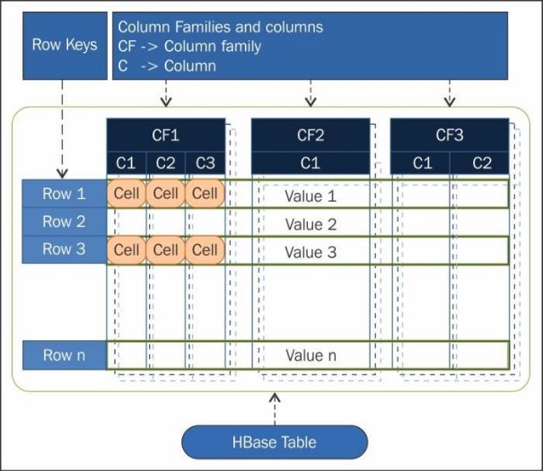

 

<br>

# TP n°04 : HBase

<br>

## <u>Table des matières</u>

- [I. Objectif du TP](#i-objectif-du-tp)
- [II. Apache HBase](#ii-apache-hbase)
   - [A. Présentation](#a-présentation)
   - [B. Modèle de données](#b-modèle-de-données)
   - [C. Architecture](#c-architecture)
- [III. Installation](#iii-installation)
- [IV. Première manipulation de HBase](#iv-première-manipulation-de-hbase)
   - [1. Hbase Shell](#1-hbase-shell)
   - [2. Création de la table](#2-création-de-la-table)
   - [3. Insertion de données](#3-insertion-de-données-create)
   - [4. Update de données](#4-mise-à-jour-de-données-update)
   - [5. Lecture de données](#5-lecture-de-données-read)
   - [6. Suppression de données](#6-suppression-de-données-delete)
   - [7. Lecture de données filtrées](#7-lecture-de-données-filtrées-read)
- [V. HBase API](#v-hbase-api)
   - [A. Happybase installation](#a-happybase-installation)
   - [B. Happybase avec Python](#b-happybase-avec-python)
- [VI. Exercice suite au tp](#vi-exercice-suite-au-tp)

<div style="page-break-after: always;"></div>

## <u>I. Objectif du TP</u>

- Après le TP02_Hadoop_HDFS et TP03_Hadoop_Map_Reduce_Python
- Manipulation de données avec HBase, et traitement avec Python

<br>

## <u>II. Apache HBase</u>

### **A. Présentation**

HBase est un système de gestion de bases de données distribué, non- relationnel et orienté colonnes, développé au-dessus du système de fichier HDFS. Il permet un accès aléatoire en écriture/lecture en temps réel à un très grand ensemble de données.

<br>

### **B. Modèle de données**

Le modèle se base sur six concepts, qui sont :

- **Table :** dans HBase les données sont organisées dans des tables. Les noms des tables sont des chaînes de caractères.
- **Row :** dans chaque table, les données sont organisées dans des lignes. Une ligne est identifiée par une clé unique (**RowKey**). La **Rowkey** n’a pas de type, elle est traitée comme un tableau d’octets.
- **Column Family :** Les données au sein d’une ligne sont regroupées par **column family**. Chaque ligne de la table a les mêmes **column families**, qui peuvent être peuplées ou pas. Les **column families** sont définies à la création de la table dans HBase. Les noms des **column families** sont des chaînes de caractères.
- **Column qualifier** : L’accès aux données au sein d’une **column family** se fait via le **column qualifier** ou **column**. Ce dernier n’est pas spécifié à la création de la table mais plutôt à l’insertion de la donnée. Comme les **rowkeys**, le **column qualifier** n’est pas typé, il est traité comme un tableau d’octets.
- **Cell :** La combinaison du **RowKey**, de la **Column Family** ainsi que la **Column qualifier** identifie d’une manière unique une cellule. Les données stockées dans une cellule sont appelées les valeurs de cette cellule. Les valeurs n’ont pas de type, ils sont toujours considérés comme tableaux d’octets.
- **Version :** Les valeurs au sein d’une cellule sont versionnés. Les versions sont identifiés par leur timestamp (de type long). Le nombre de versions est configuré via la **Column** **Family**. Par défaut, ce nombre est égal à trois.



Les données dans HBase sont stockées sous forme de **HFiles**, par colonnes, dans **HDFS**. Chaque **HFile** se charge de stocker des données correspondantes à une **column family** particulière.


Autres caractéristiques de HBase:

- HBase n'a pas de schéma prédéfini, sauf qu'il faut définir les familles de colonnes à la création des tables, car elles représentent l'organisation physique des données
- HBase est décrite comme étant un magasin de données clef/valeur, où la clef est la combinaison (**row-column family-column-timestamp**) représente la **clef**, et la **cell** représente la valeur.

<br>

### **C. Architecture**

Physiquement, **HBase** est composé de trois types de serveurs de type **Master/Slave**.

- **Region Servers**: permettent de fournir les données pour lectures et écritures. Pour accéder aux données, les clients communiquent avec les **RegionServers** directement.
- **HBase HMaster** : gère l'affectation des régions, les opérations de création et suppression de tables.
- **Zookeeper**: permet de maintenir le cluster en état.

Le **DataNode** de **Hadoop** permet de stocker les données que le **Region Server** gère. Toutes les données de **HBase** sont stockées dans des fichiers **HDFS**. Les **RegionServers** sont colocalisés avec les **DataNodes**.

Le **NameNode** permet de maintenir les métadonnées sur tous les blocs physiques qui forment les fichiers.


- Les tables **HBase** sont divisées horizontalement, par **row** en plusieurs **Regions**. Une **region** contient toutes les lignes de la table comprises entre deux clefs données. Les **regions** sont affectées à des nœuds dans le cluster, appelés **Region Servers**, qui permettent de servir les données pour la lecture et l'écriture. Un **region server** peut servir jusqu'à 1000 régions.
- Le **HBase Master** est responsable de coordonner les **region servers** en assignant les régions au démarrage, les réassignant en cas de récupération ou d'équilibrage de charge, et en faisant le monitoring des instances des **region servers** dans le cluster. Il permet également de fournir une interface pour la création, la suppression et la modification des tables.
- **HBase** utilise **Zookeeper** comme service de coordination pour maintenir l'état du serveur dans le cluster. **Zookeeper** sait quels serveurs sont actifs et disponibles, et fournit une notification en cas d'échec d'un serveur.

<div style="page-break-after: always;"></div>

## <u>III. Installation</u>

HBase est installé sur le même cluster que précédemment. Suivre les étapes décrites dans la partie Installation du TP01_Hadoop_HDFS pour télécharger l'image et exécuter les trois conteneurs.

1. Lancer vos machines grâce aux commandes suivantes:  

   `docker start hadoop-master hadoop-slave1 hadoop-slave2`

2. Puis d'entrer dans le conteneur master:  

   `docker exec -it hadoop-master bash`

3. Lancer ensuite les démons yarn et hdfs:

   `./start-hadoop.sh`

4. Lancer HBase en tapant:

   `start-hbase.sh`

5. Une fois c'est fait, en tapant **jps**, vous devriez avoir un résultat ressemblant au suivant:

   

   Vous remarquerez que tous les démons Hadoop (**NameNode**, **SecondaryNameNode** et **ResourceManager**) ainsi que les démons **HBase** (**HRegionServer**, **HMaster** et **HQuorumPeer** (**Zookeeper**)) sont démarrés

<div style="page-break-after: always;"></div>

## <u>IV. Première manipulation de HBase</u>

De manière générale, vous aurez très peu de retour sur les commandes hbase shell. Il faudra tout le temps passer par un Get ou scan (partie 5) pour voir les données.

Exemple de retour:

```bash
0 row(s) in 0.0090 seconds
```

:warning: L'emplacement des **'** et des **"** sont importants, car on aura les 2 dans certaines commandes et que si on ne met pas les bon, la commande ne fonctionnera pas.

### **1. HBase Shell**

Pour manipuler votre base de données avec son **Shell** interactif, vous devez lancer le script suivant:

- `hbase shell`

Vous obtiendrez une interface ressemblant à la suivante:


Nous allons créer une base de données qui contient les données suivantes:


Vous pourrez fermer le terminal hbase en faisant `exit`.

<div style="page-break-after: always;"></div>

### **2. Création de la table**

Pour créer une table dans HBase avec deux familles de colonnes différentes et spécifier un namespace :

```bash
# create 'table', 'cf1', 'cf2', ...
create 'store', 'customer', 'sales'
```

- la table 'store' est créée
- 'customer' et 'sales' sont les noms des familles de colonnes.

<br>

### 3. **Insertion de données (Create)**

Pour insérer des données dans HBase, utilisez la commande `put`.

```bash
# put 'table', 'rowkey', 'family:colonne', 'data'
put 'store', '1001', 'customer:name', 'John White'
put 'store', '1001', 'customer:city', 'Los Angeles, CA'
put 'store', '1001', 'sales:product', 'Chairs'
put 'store', '1001', 'sales:amount', '$400.00'

put 'store', '1002', 'customer:name', 'Jane Brown'
put 'store', '1002', 'customer:city', 'Antlanta, GA'
put 'store', '1002', 'sales:product', 'Lamps'
put 'store', '1002', 'sales:amount', '$200.00'

put 'store', '1003', 'customer:name', 'Bill Green'
put 'store', '1003', 'customer:city', 'Pittsburgh, PA'
put 'store', '1003', 'sales:product', 'Desk'
put 'store', '1003', 'sales:amount', '$500.00'

put 'store', '1004', 'customer:name', 'Jack Black'
put 'store', '1004', 'customer:city', 'St. Louis, MO'
put 'store', '1004', 'sales:product', 'Bed'
put 'store', '1004', 'sales:amount', '$1,600.00'
```

<div style="page-break-after: always;"></div>

### 4. **Mise à jour de données (Update)**

Pour mettre à jour une valeur spécifique dans HBase, utilisez à nouveau la commande `put`.

```bash
# put 'table', 'row_key', 'cf:colonne', 'modification'
put 'store', '1002', 'sales:amount', '$850.00'

# ROW          COLUMN+CELL
#  1002        column=customer:city, timestamp=1720091566406, value=Antlanta, GA
#  1002        column=customer:name, timestamp=1720091566379, value=Jane Brown
#  1002        column=sales:amount, timestamp=1720091574415, value=$850.00
#  1002        column=sales:product, timestamp=1720091566425, value=Lamps
```

<br>

### 5. **Lecture de données (Read)**

Pour lire des données spécifiques à partir de HBase, utilisez la commande `get` pour récupérer la donnée voulu grâce à son row_key.

```bash
# get 'table', 'row_key'
get 'store', '1001'

# ROW          COLUMN+CELL
#  1001        column=customer:city, timestamp=1720091566297, value=Los Angeles, CA
#  1001        column=customer:name, timestamp=1720091566267, value=John White
#  1001        column=sales:amount, timestamp=1720091566349, value=$400.00
#  1001        column=sales:product, timestamp=1720091566320, value=Chairs
```

Pour lire des données spécifiques à partir de HBase, utilisez la commande `scan` pour récupérer toutes les données.

```bash
# scan 'table'
scan 'store'

# ROW          COLUMN+CELL
#  1001        column=customer:city, timestamp=1720091566297, value=Los Angeles, CA
#  1001        column=customer:name, timestamp=1720091566267, value=John White
#  1001        column=sales:amount, timestamp=1720091566349, value=$400.00
#  1001        column=sales:product, timestamp=1720091566320, value=Chairs
#  1002        column=customer:city, timestamp=1720091566406, value=Antlanta, GA
# ...
# 4 row(s) in 0.0240 seconds
```

<div style="page-break-after: always;"></div>

### 6. **Suppression de données (Delete)**

Pour supprimer une valeur spécifique, utilisez la commande `delete`.

```bash
# put 'table', 'row_key', 'cf:colonne',
delete 'store', '1003', 'sales:amount'

# COLUMN                CELL
#  customer:city        timestamp=1720091566495, value=Pittsburgh, PA
#  customer:name        timestamp=1720091566478, value=Bill Green
#  sales:product        timestamp=1720091566509, value=Desk
```

Pour supprimer entièrement une donnée, utilisez la commande `deleteall`.

```bash
deleteall 'store', '1004'

# COLUMN                                                       CELL
# 0 row(s) in 0.2140 seconds
```

<div style="page-break-after: always;"></div>

### 7. **Lecture de données filtrées (Read)**

Afin d'avoir uniquement ce que l'on souhaite, il existe plusieurs filtre comme LIMIT, COLUMS, FILTER...

Pour manipuler les données dans votre table HBase `store` et n'obtenir que les résultats souhaités

La structure de la commande se compose comme ceci : `scan 'table', {OPTION1 => "filtre"}`

<br>

> Utilisation de LIMIT

Pour limiter le nombre de lignes retournées par le scan, utilisez l'option `LIMIT`.

```bash
# Retourne les deux premières lignes de la table `produits`.
scan 'store', { LIMIT => 2 }

# ROW             COLUMN+CELL
#  1001           column=customer:city, timestamp=1720091566297, value=Los Angeles, CA
#  1001           column=customer:name, timestamp=1720091566267, value=John White
#  1001           column=sales:amount, timestamp=1720091566349, value=$400.00
#  1001           column=sales:product, timestamp=1720091566320, value=Chairs
#  1002           column=customer:city, timestamp=1720091566406, value=Antlanta, GA
#  1002           column=customer:name, timestamp=1720091566379, value=Jane Brown
#  1002           column=sales:amount, timestamp=1720091574415, value=$850.00
#  1002           column=sales:product, timestamp=1720091566425, value=Lamps
# 2 row(s) in 0.0120 seconds
```

<br>

> Utilisation de COLUMNS

Pour ne sélectionner que certaines colonnes lors du scan, utilisez l'option `COLUMNS`.

```bash
# Retourne les valeurs des colonnes `customer:name` et `sales:amount` pour toutes les lignes de la table `produits`.
scan 'store', { COLUMNS => ['customer:name', 'sales:amount'] }

# ROW             COLUMN+CELL
#  1001           column=customer:name, timestamp=1720091566267, value=John White
#  1001           column=sales:amount, timestamp=1720091566349, value=$400.00
#  1002           column=customer:name, timestamp=1720091566379, value=Jane Brown
#  1002           column=sales:amount, timestamp=1720091574415, value=$850.00
#  1003           column=customer:name, timestamp=1720091566478, value=Bill Green
# 3 row(s) in 0.0100 seconds
```

<div style="page-break-after: always;"></div>

> Utilisation de FILTER

Pour appliquer un filtre aux résultats du scan, utilisez l'option `FILTER`. Il existe plusieurs types de filtres, mais nous utiliserons ici `SingleColumnValueFilter`.

```bash
# Retourne les lignes où la colonne `sales:amount` a une valeur de 400.
scan 'store', { FILTER => "SingleColumnValueFilter('sales', 'amount', =, 'binary:$400.00')" }

# ROW             COLUMN+CELL
#  1001           column=customer:city, timestamp=1720091566297, value=Los Angeles, CA
#  1001           column=customer:name, timestamp=1720091566267, value=John White
#  1001           column=sales:amount, timestamp=1720091566349, value=$400.00
#  1001           column=sales:product, timestamp=1720091566320, value=Chairs
#  1003           column=customer:city, timestamp=1720091566495, value=Pittsburgh, PA
#  1003           column=customer:name, timestamp=1720091566478, value=Bill Green
#  1003           column=sales:product, timestamp=1720091566509, value=Desk
# 2 row(s) in 0.0160 seconds
```

:warning: les colonnes qui n'ont pas de données seront affichées dans ce cas.

<br>

> Combinaison d'options

C'est bien d'avoir des filtres différents pour avoir nombres de possibilitées, mais le but final est de pouvoir les combiner. Afin de les combiner, on va juste enchainer les options et les filtres dans les accolades : `scan 'table', {OPTION1 => "filtre", OPTION2 => "filtre"}`

```bash
# affiche uniquement le nom du client et le produit pour tous les clients qui ont acheté un objet à 1200€
scan 'store', { COLUMNS => ['customer:name', 'sales:amount'], FILTER => "SingleColumnValueFilter('sales', 'amount', =, 'binary:$400.00')" }

# ROW                                                          COLUMN+CELL
#  1001                                                        column=customer:name, timestamp=1720091566267, value=John White
#  1001                                                        column=sales:amount, timestamp=1720091566349, value=$400.00
#  1003                                                        column=customer:name, timestamp=1720091566478, value=Bill Green
# 2 row(s) in 0.0170 seconds
```

<div style="page-break-after: always;"></div>

## <u>V. HBase API</u>

HBase fournit une API en Python : [HappyBase](https://happybase.readthedocs.io/en/latest/) pour pouvoir manipuler en développant les données de la base. Nous allons montrer ici un exemple très simple.

*On part du principe que les services sont toujours lancés dans votre conteneur.*

<br>

### **A. Happybase installation**

Happybase est une bibliothèque Python conviviale pour les développeurs permettant d'interagir avec Apache HBase. HappyBase est conçu pour être utilisé dans configurations HBase standard et offre aux développeurs d'applications une API Python pour interagir avec HBase. En dessous de la surface, HappyBase utilise la bibliothèque Python Thrift pour se connecter à HBase à l'aide de sa passerelle Thrift.

Dans le contexte de HBase, Java est le seul langage qui peut accéder directement à HBase. L'interface Thrift agit comme un pont qui permet à d'autres langages d'accéder à HBase à l'aide d'un serveur Thrift qui interagit avec le client Java.


Pour utiliser happybase sur python il faut tout d’abord l’installer en utilisant la commande suivante : *pip install happybase*

<span style="color:red">Note :</span>

Si la commande *pip* n’est pas installer sur votre python, lancer les commandes suivantes :

1. apt update
2. apt upgrade
3. apt install curl
4. curl https://bootstrap.pypa.io/pip/3.5/get-pip.py --output get-pip.py
5. python3 get-pip.py
6. apt install python3-pip
7. pip –version
8. pip3 --version

Pour que Thrift fonctionne, un autre démon HBase doit être en cours d'exécution pour gérer ces demandes.

1. start-hbase.sh
2. hbase-daemon.sh start thrift
3. jps


<br>

### **B. happybase avec Python**

Par défaut, le service thrift écoute sur le port 9090. On va lancer une connexion vers la table déjà crée.

```python
#!/usr/bin/env python

import happybase
connection = happybase.Connection('127.0.0.1', 9090)
connection.open()

table = connection.table('sales_ledger')
print("La liste des tables sur HBASE est : ")
print(connection.tables())
print(" nous avons aussi la table : ")
print(table)
connection.close()
```

Résultat :


Happybase syntaxes :

1. La création des tables :

   ```python
   connection.create_table(
      'mytable',
      {
         'cf1': dict(max_versions=10),
         'cf2': dict(max_versions=1, block_cache_enabled=False),
         'cf3': dict(),
      }
   )
   ```

2. La Connection à une table :

   ```python
   table = connection.table('mytable')
   ```

3. Récupération des données

   ```python
   row = table.row('row-key')
   print row['cf1:col1']

   rows = table.row(['row-key-1', 'row-key-2'])
   for key, data in rows:
      print key, data

   for key, data in tables.scan():
      print key, data
   ```

   all rows from row aaa the end of the table:

   ```python
   for key, data in tables.scan(row_start='aaa'):
      print key, data

   for key, data in tables.scan(row_stop='xyz'):
      print key, data

   for key, data in tables.scan(row_start='aaa', row_stop='xyz'):
      print key, data
   ```

4. Stockage des données

   ```python
   table.put(
      'row-key',
      {
         'cf:col1':'value1',
         'cf:col2':'value2'
      } 
   )
   ```

   ```python
   #!/usr/bin/env python

   import happybase
   connection = happybase.Connection('127.0.0.1', 9090)
   connection.open()
   print(connections.tables())
   table = connection.table('sales_ledger')
   rows = table.row(['101','102'])
   for key, data in rows:
      print(key, data)
   connection.close()
   ```

5. Résultat :

   

<div style="page-break-after: always;"></div>

## <u>VI. Exercice suite au TP</u>

### **hbase shell**

Quelles sont les commandes hbase pour faire ses instructions ?

1. Créer la table **bibliothèque** avec deux colonnes **auteur** (nom et prénom), **livre** (titre, categ, date).
2. Ajouter les données suivantes :

   | row_key | auteur:nom   | auteur:prenom | livre:titre| livre:categ  | livre:date |
   | ------- | ------------ | ------ | ---------------------- | ------ | ---- |
   | vhugo   | Hugo         | Victor | La légende des siècles | Poèmes | 1855 |
   | jverne  | Verne        | Jules  | Face au drapeau        | Roman  | 1896 |

3. Afficher toutes les données de la table.
4. Afficher la liste des livres stockés pour vhugo.
5. Modifier la date du livre de 'vhugo' pour 2024.
6. Supprimer 'livre:categ' de 'vhugo'.
7. Afficher les livres qui sont sortis après la fin du 20e siècle.
8. Supprimez toutes les données de 'jverne'

<br>

### **Happybase Python**

1. Ecrire le code Python qui permet de réaliser les instructions précedents depuis l'environnement hadoop.
2. Adapter le code pour controler le Hbase distant depuis votre poste local.

<br>

:pushpin: **AIDE:** Utilisez l'IP de la machine et le bon port public relié au port privé que vous souhaitez utiliser.
