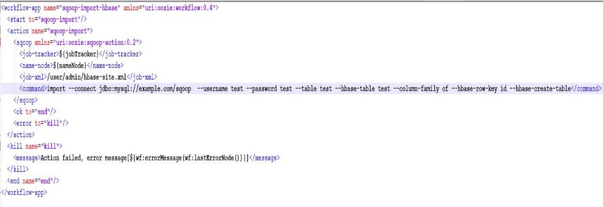

 

 

# Oozie

 

## <u>Introduction oozie</u>

### **Pourquoi Oozie ?**

Avant de présenter Oozie, on va énumérer trois situations pour comprendre mieux son rôle.

#### 1ère situation

    3 lignes d’exécution des tâches d’importation des données vers un cluster Hadoop.

    La règle conditionnelle imposée :
    Présenter le job 2 au niveau du cluster Hadoop avant le job 6 au niveau de la ligne 1 étant donné que le rythme d’exécution au niveau de la ligne 1 est de loin supérieur que celui de la ligne 2.

_Problématique : Dans ce cas là qui va assurer le respect de cette règle d’exécution ?_

#### 2ème situation

    3 lignes d’exécution des tâches d’importation des données vers un cluster Hadoop.

    Règles conditionnelle imposée :
    L’exécution du job 5 au niveau de la ligne 1 doit se faire exactement à 01h50min. L’exécution du job 3 au niveau de la ligne 2 doit se faire exactement 07h15. L’exécution du job 4 au niveau de la ligne 3 doit se faire exactement à 04h00.

_Problématique : Dans ce cas, qui va assurer le respect de cette contrainte temporelle imposée au niveau des 3 lignes ?_

#### 3ème situation

    Au niveau de la première ligne, on va supposer que le job 6 de la ligne 1 produit un output (Des fichiers, des modifications au niveau des bases de données…etc).

    Règle conditionnelle imposée :
    L’output produit soit pris en amant au niveau de job 3 de la ligne 2

_Problématique : Qui va orchestrer cette manœuvre ?_

## <u>Présentation de Oozie</u>

### **C’est quoi Oozie ?**

Apache Oozie est un système d’ordonnancement visant à gérer et exécuter des jobs Hadoop dans un environnement distribué. Vous pouvez créer des pipelines en combinant différentes tâches, tels que Hive, MapReduce ou encore Pig.

Le Oozie :C'est un planificateur de workflow qui permet de donner les tâches d’importation envers le HDFS et permet également de notifier le HDFS en termes de fichiers importés et exportés.

Oozie est responsable du déclenchement de vos différents workflows. La complétion des tâches est détectée selon un principe de callback et de sondage. Lorsque Oozie démarre une tâche, il fournit automatiquement une URL HTTP unique de callback à la tâche et notifie cette URL dès que la tâche est terminée. Dans le cas où la tâche échoue à invoquer l’URL de callback, Oozie peut sonder la tâche pour vérifier si elle est terminée.

Oozie est en fait un système de planification qui permet d’exécuter et de gérer des tâches Hadoop dans un environnement distribué. Il permet de combiner plusieurs tâches complexes dans un ordre séquentiel pour accomplir une tâche plus importante.

Oozie va donc assurer l’orchestration en parallèle de l’exécution de ces diverses tâches qui sont présentées au niveau des 3 lignes.

L’un des principaux avantages d’Oozie c’est qu’il est étroitement intégré à la pile Hadoop prenant en charge les diverses tâches Hadoop tels que Hive, Pig, Scoop…etc ainsi que des tâches spécifiques au système tels que les tâches Java.

### **Les fonctionnalités de Oozie**

Apache Oozie offre un large éventail de fonctionnalités qui vous permettront de planifier et de coordonner efficacement vos travaux Hadoop. Voici quelques unes des fonctionnalités clé de Oozie :

- **Planification automatisée des workflows :** Oozie permet d’ordonnancer vos workflows selon des conditions de temps, de données ou d’événements.
- **Intégration :** Oozie est conçu pour s’intégrer simplement avec d’autres outils populaires de Hadoop, tels que Hive, MapReduce, Spark ou HBase.
- **Gestion des erreurs :** Une fonctionnalité de gestion des erreurs avancée est fournie, permettant aux utilisateurs de prendre les décisions adéquates en cas de problème.
- **Interface graphique :** Oozie est livré avec une interface graphique conviviale qui permet aux utilisateurs de visualiser et de gérer leurs workflows de manière efficace.

### **Fonctionnement de Oozie**

Apache Oozie dispose de 3 types de travaux :

#### 1. Workflow Oozie

Un workflow Oozie est une séquence d’actions organisée en graph acyclique dirigé (DAG). Ces actions dépendent les unes par rapport aux autres, de sorte que la prochaine action ne peut être exécutée qu’après la sortie de l’action précédente.

Différents types d’actions peuvent être créées en fonction du besoin:

- **L’Action Nodes :** Peuvent être des actions de type Pig,Hive,map Reduce,Java…etc
- **Les Control Nodes :** Représentant l’état du Workflow à l’instant t tels que Start, Fork, Join, Decision, et End.

#### 2. Oozie Coordinator

Le coordinateur Oozie vous permettra d’ordonnancer des workflows complexes. Il déclenche ces workflows en fonction des prédicats de temps, de données ou d’événements. Ainsi, les workflows commencent dès que la condition donnée est satisfaite.

- start : Date et heure de début du travail
- end : Date et heure de fin du travail
- timezone : Fuseau horaire de l’application de coordination
- frequency : En minutes, la fréquence pour l’exécution des travaux
- Certaines propriétés supplémentaires sont également disponibles pour les informations de contrôles :
- timeout : Le temps maximum, en minutes, pendant lequel une action attendra de satisfaire les conditions, avant d’être rejetée
- concurrency : Le nombre maximum d’actions pouvant s’exécuter en parallèle
- execution : Ordre d’exécution, parmi FIFO, LIFO et LAST_ONLY

#### 3. Oozie Bundle

Les bundles Oozie ne sont pas à proprement parler un type de job. Il s’agit d’un regroupement de plusieurs tâches de type coordinator ou workflow. Les bundles en génèrent ainsi leur cycle de vie.

#### workflow.xml

#### Job.properties

