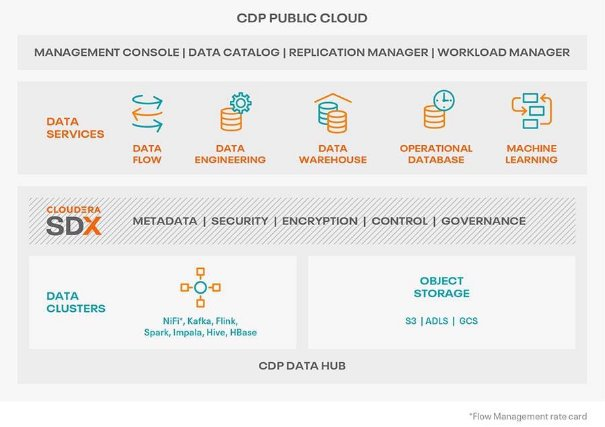
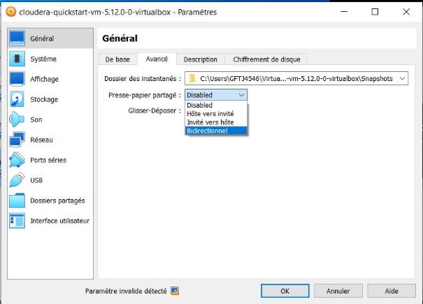
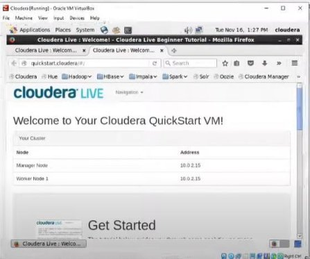
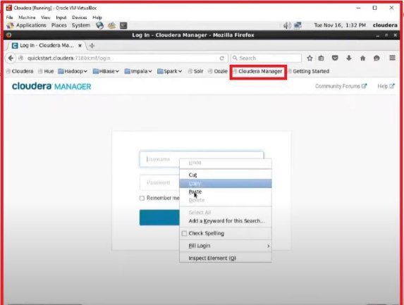
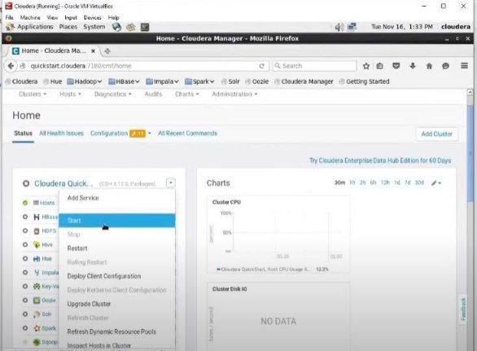
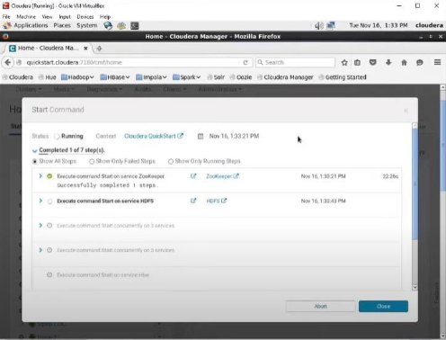
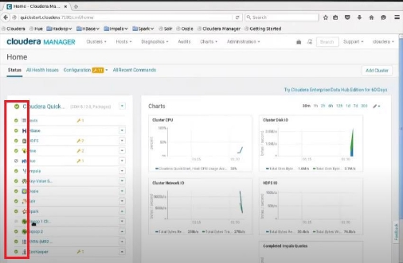

 

 

# TP n°06 : Oozie

 

## <u>Table des matières</u>

- [I. Objectif du TP](#i-objectif-du-tp)
- [II. Démarrer avec Cloudera](#ii-démarrer-avec-cloudera)
   - [A. Installation et configuration de Cloudera](#a-installation-et-configuration-de-cloudera)
- [III. Démarrer avec Oozie sur Cloudera](#iii-démarrer-avec-oozie-sur-cloudera)
   - [A. Les exemples Oozie fournis par cloudera](#a-les-exemples-oozie-fournis-par-cloudera)
   - [B. Les exercices suite au TP](#b-exercices-suite-au-tp)

## <u>I. Objectif du TP</u>

- Initiation à l’outil Oozie avec cloudera

 

### **A. Présentation cloudera**

Cloudera est une entreprise Américaine basée en Californie, elle se consacre au développement d’une solution Big Data basée historiquement sur le framework distribué Hadoop et qui est en train de se réorienter vers le Cloud. La Cloudera Data Plateform permet une gestion unifiée, centralisée et hybride des infrastructures Big Data pour toutes les entreprises souhaitant traiter de la donnée.

Il s’agit par ailleurs d’une solution complète intégrant les expériences de gestion Big Data et d’analyse tout au long du cycle de vie des données. Elle assure aussi la sécurité, la conformité aux normes  en  vigueur,  la  migration  des  données  et  la  gestion  des  métadonnées  sur  tous  les environnements.

## <u>II. Démarrer avec Cloudera</u>

### **A. Installation et configuration de Cloudera**

1. Télécharger et installer Virtual box :
   - [https://www.virtualbox.org/wiki/Downloads](https://www.virtualbox.org/wiki/Downloads)

2. Puis, télécharger Cloudera quick Start VM:
   - [https://downloads.cloudera.com/demo_vm/virtualbox/cloudera- quickstart-vm-5.12.0-0-virtualbox.zip](https://downloads.cloudera.com/demo_vm/virtualbox/cloudera-quickstart-vm-5.12.0-0-virtualbox.zip)

3. Installer virtual box et importer Cloudera QuickStart VM:
   - 

   **Note :** 8G minimum et 2 CPU minimum

   

   

   

4. Après, aller sur terminal et lancer la commande :
   - `sudo /home/cloudera/cloudera-manager --force --express`:

   

5. Attendre, quelques minutes jusqu’au avoir ce message :

   

6. Puis, sur le navigateur lancer le Cloudera manager et se connecter avec les username et le mot de passe fourni avant :

   

7. Lancer les différents outils big data en cliquant sur le Button Start :

   

8. Attendre, un moment que le lancement termine :

   

Tous les outils sont lancés :

   

## <u>III. Démarrer avec Oozie sur Cloudera</u>

### **A. Les exemples Oozie fournis par cloudera**

1. Lancer la commande suivante sur le terminal :

   `tar -xvf /usr/share/doc/oozie-4.1.0+cdh5.12.0+442/oozie-examples.tar.gz -C /home/cloudera/Desktop`

2. Aller sur le dossier exemples/apps/java-main :

   Les deux fichiers communs d’Oozie est trouvé « job.properties » et « workflow.xml »

   

3. Changer le fichier Job.Properties:

   `nameNode=hdfs://quickstart.cloudera:8020 jobTracker=quickstart.cloudera:8032`

 

### **B. Exercices suite au TP**

1. Mettre les exemples dans HDFS.
2. Vérifier que les fichiers sont bien transférés.
3. La port Oozie sur cloudera est 11000, lancer le job  
   **/home/cloudera/Desktop/examples/apps/java-main/job.properties** via Oozie.
4. Vérifier le statut de Job Oozie.
5. Chercher le Job Oozie sur cloudera Manager.
6. Lancer le job mapreduce de wordcount via oozie.
